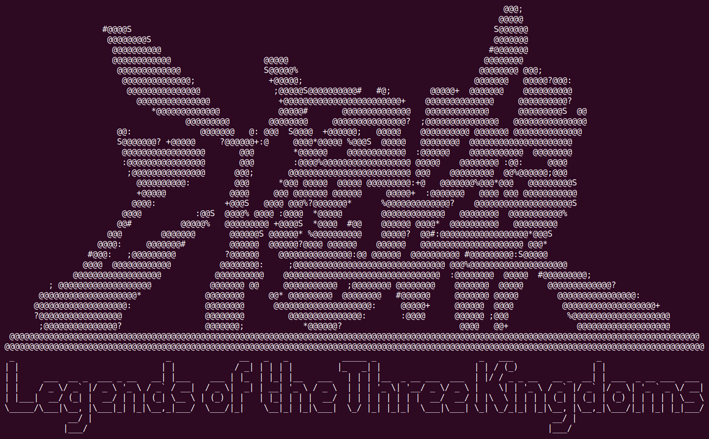

# Lab Four: Legends of the Three Kingdoms

## Introduction

Legends of the Three Kingdoms (三国杀) is a Chinese card game based on the [Three Kingdoms](https://en.wikipedia.org/wiki/Three_Kingdoms) period of China. The cards and heroes of LTK are all related to the history, the most telling of which are the heroes and their abilities. Each hero is given an ability in the game which usually mirrors the historical character's personality, actions, strength/weakness, cause of death, and historical events in which the character was involved, etc. In this lab, we are going to develop a C++ version of LTK, which covers most of the basic cards and scroll cards, as well as a large number of heroes with different abilities.



The rules of this LTK in C++ is simplified from the original version. There are two types of players, HumanPlayer controlled by your keyboard and MyopicPlayer controlled by your code. Players are grouped into multiple camps at the beginning of game. Each player should try to kill the players in a different camp. When there is only one camp left, all the players of this camp win the game.

When the game starts, the players list is shuffled and each player is randomly assigned a hero and four cards. Please refer to the "Implementation" section for the descriptions of each card and hero. Depending on the hero, a player gets several health points (usually 3 or 4).

During the game, the players take their turns one by one. There are three main phases in a player's turn.

1. **Drawing phase**
   
   The player draws two cards from the deck. The function `Player::drawCards(2)` is called in this phase.

2. **Action phase**

   Any number of cards may be played, but generally, each player may only use the **Strike** card once. The function `Player::playCard()` is called for each card being played. The player is first requested to select a card. Then the `Card::takeEffect(source, targets)` function of the selected card is called, with the following steps taking place in this function. 
   
   For those cards that require a target, the player is further requested to select another player as the target by calling the function `Player::selectTarget()`. After these selections, the card has taken effect and the target may be requested for a response card, for example, a **Dodge** for a **Strike**. This step is done by calling `Player::requestCard(DODGE)` upon the target player. If the target player fails to respond, he will get some penalty depending on the card's effect, which is usually losing one health point. If a player's health points decrease to 0 and no one plays a **Peach** card, the player is killed and no longer takes any turn.
   
3. **Discard phase**

   After playing, the player will have to discard cards in his hand such that the remaining number of cards is equal to his current health points. The function `Player::discardCards()` is called in this phase.
   
   

The commands for HumanPlayers to control their characters are listed below. Commands 1 to 5 are general commands that can be executed anytime during a game. Commands 6 to 11 can only be used when prompted.

1. `clear`

   Clear the screen so that the next player cannot see the records of your turn.

2. `players`

   List all the players and display their names, health points and heroes.

3. `player <n>`

   Display one player's information according to the index in players list, which includes the player's name, health points and hero with ac ASCII Art.

4. `player`

   Display the current player's information.

5. `cards`

   List all the cards of the current player.
   
6. `card 0`

   Refuse to play any card.

7. `card <n>`

   Select one card to play.

8. `card* <n>`

	Use the hero's ability to play one card.

9. `card*`

   Use the hero's ability if no card needs to be played.

10. `target <n>`

    Select the target of a card.
   
11. `discard <n1> <n2> ...`

    Discard the required number of cards.


## Implementation

1. **Cards**

   - **Strike** (Implementation provided)

     

     Strike another player. Can be avoided using a **Dodge**, otherwise causes −1 health damage. Can only be played once in a turn.

   - **Dodge** (Implementation provided)

     

     Dodge a strike. Can only be played to counter a **Strike**.

   - **Peach** (Implementation provided)

     

     Recover one health point. Can be played on another hero only if he is dying.

   - **Arrow Barrage** (To be implemented in 7/18 lab section)

     

     Take effect on all players, except the current player. Must play a **Dodge** or receive −1 health damage.

   - **Barbarian Invasion** (To be implemented in 7/19 lab section)

     

     Take effect on all players, except the current player. Must play a **Strike** or receive −1 health damage.

   - **Something for Nothing** (Implementation provided)

     

     Draw two cards.

   - **Bountiful Harvest** (Implementation provided)

     

     Each player draws one card.

   - **Dismantle** (To be implemented in 7/18 lab section)

     

     Discard any card of another player.

   - **Snatch** (To be implemented in 7/18 lab section)

     

     Seize any card of another player.

   - **Duel** (To be implemented in 7/19 lab section)

     

     Challenge another player into a duel during which the two players have to play **Strike** cards. The first one not playing **Strike** gets -1 health damage;

2. **Heroes**

	- **Zhao Yun** (Implementation provided)

	  
	  
	  **[Courage]** You may treat your **Strike** as a **Dodge** or your **Dodge** as a **Strike**.
	  
	- **Zhen Ji** (To be implemented in 7/18 lab section)

	  
	  
	  **[Gorgeous]** All your black color suit hand cards may be treated as **Dodge**.
	  
	- **Hua Tuo** (To be implemented in 7/19 lab section)

	  
	  
	  **[Triage]** You may use any of your red color suit cards as **Peach**.
	  
	- **Lu Bu** (To be implemented in 7/18 lab section)

	  
	  
	  **[Unrivaled]** When you use **Strike**, your target must use two **Dodge** to dodge your **Strike**.
	  
	- **Diao Chan** (To be implemented in 7/19 lab section)

	  
	  
	  **[Mischief]** During your play phase, you may discard one card and select two Male Heroes and have them **Duel** each other.

3. **MyopicPlayer**

	We have provided you with all the implementation of `HumanPlayer`, but so far the strategies of `MyopicPlayer` are quite stupid. You need to update the following two functions to make it more challenging to play against a MyopicPlayer. It's also encouraged to think about how to update other functions, such as `void MyopicPlayer::discardCards()`, to make the MyopicPlayer more like a ProvidentPlayer.
	
	- `void MyopicPlayer::playCard()`

	  For now a MyopicPlayer randomly selects a card to play in his turn, even if he doesn't know whether the card would take effect. He has no idea about how to use the hero's ability either.
	  
	  Hint: You may find our implementation of `void HumanPlayer::playCard()` and `const Card *MyopicPlayer::requestCard(Action action)` helpful.
	  
	- `Player *MyopicPlayer::selectTarget()`

	  If the randomly selected card requires a target, the current MyopicPlayer can select any player, regardless of whether the target belongs to his camp or whether the target is himself. 

## Compilation
You can utilize the `Makefile` to compile:

```
make
```

or type the following command:

```
g++ -std=c++11 -Wall -o ltk card.cpp deck.cpp exceptions.cpp game.cpp hero.cpp ltk.cpp player.cpp
```

Then you can run the executable:

```
./ltk
```


## Submission

Please make a fork of the VE280 GitHub repository at <https://github.com/ve280/ve280>, then commit your updates to the files in `labs/lab4` and create a pull request. You can refer to this [tutorial](https://github.com/ve280/tutorials/blob/master/github_introduction.md#4-contribute-to-a-public-repository) on how to create pull requests.


## Acknowledgement

Lab 4 problems are designed by [Zian Ke](https://github.com/zianke) and [Jiayi Chen](https://github.com/Janecjy).


## Reference

[1] 三国杀Online. <https://www.sanguosha.com>.

[2] LTK Official Website. <http://sanguosha.us>.

[3] Wikipedia: Legends of the Three Kingdoms. <https://en.wikipedia.org/wiki/Legends_of_the_Three_Kingdoms>.