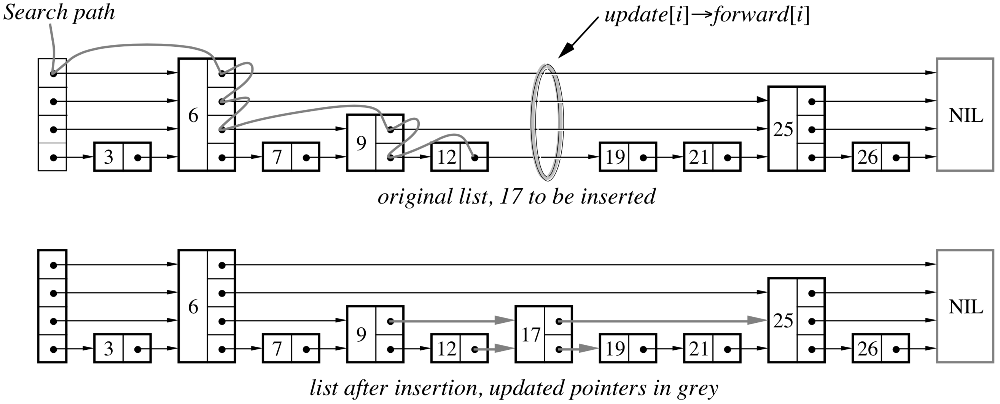

# Lab Five: Skip List

## Introduction

Skip list is a data structure that allows `O(log n)` search complexity as well as `O(log n)` insertion/deletion complexity within an ordered sequence of `n` elements. It's widely used in database management systems such as [Redis](https://en.wikipedia.org/wiki/Redis) as the implementation of ordered set and key/value storage. In this lab we are going to implement a skip list with C++, which allows users to insert/search/remove elements. The goal of your implementation is to achieve a better performance on maintaining an ordered sequence of elements compared to the STL `list` and `vector`.



Skip list's internal structure and algorithms are described in details in the [Skip Lists](https://epaperpress.com/sortsearch/download/skiplist.pdf) paper by William Pugh. The search/insert/remove algorithms have been slightly modified to adapt the needs of this lab, the pseudocodes of which are attached below.

<pre>
Search(list, value)
	x := list→header
	<b>for</b> i := list→level <b>downto</b> 1 <b>do</b>
		<b>while</b> x→forward[i]→value < value <b>do</b>
			x := x→forward[i]
	x := x→forward[1]
	<b>if</b> x→value = value <b>then</b> <b>return</b> true
		<b>else</b> <b>return</b> false
</pre>

<pre>
Insert(list, value)
	<b>local</b> update[1..MaxLevel]
	x := list→header
	<b>for</b> i := list→level <b>downto</b> 1 <b>do</b>
		<b>while</b> x→forward[i]→value < value <b>do</b>
			x := x→forward[i]
		update[i] := x
	x := x→forward[1]
	<b>if</b> x→value ≠ value <b>then</b>
		rlevel := randomLevel()
		<b>if</b> rlevel > list→level <b>then</b>
			<b>for</b> i := list→level + 1 <b>to</b> rlevel <b>do</b>
				update[i] := list→header
			list→level := rlevel
		x := makeNode(rlevel, value)
		<b>for</b> i := 1 <b>to</b> rlevel <b>do</b>
			x→forward[i] := update[i]→forward[i]
			update[i]→forward[i] := x
</pre>

<pre>
Remove(list, value)
	<b>local</b> update[1..MaxLevel]
	x := list→header
	<b>for</b> i := list→level <b>downto</b> 1 <b>do</b>
		<b>while</b> x→forward[i]→value < value <b>do</b>
			x := x→forward[i]
		update[i] := x
	x := x→forward[1]
	<b>if</b> x→value = value <b>then</b>
		<b>for</b> i := 1 <b>to</b> list→level <b>do</b>
			<b>if</b> update[i]→forward[i] ≠ x <b>then</b> <b>break</b>
			update[i]→forward[i] := x→forward[i]
		free(x)
		<b>while</b> list→level > 1 <b>and</b> list→header→forward[list→level] = NIL <b>do</b>
			list→level := list→level - 1
</pre>

## Implementation

Our implementation of `SkipList` will utilize the C++ templates mechanism to support arbitrary element data type. Aside from the search/insert/remove functions, you also need to implement the class constructor and destructor, as well as the copy constructor and assignment operator.

1. `SkipList<T>::SkipList()`

	- An empty skip list should have `this->level` equal to 1.

	- Regardless of the value of `this->level`, `this->header` always points to a `Node` with `MAX_LEVEL`, where `this->header->forward[i]` is `nullptr` for empty levels.

2. `SkipList<T>::~SkipList()`

	- To delete every node, we need to traverse the lowest level of a skip list.

	- We can start from `node = this->header`, delete it, then move on to `node->forward[0]`.

3. `bool SkipList<T>::search(T value) const`

	- We start from the highest level, i.e. `this->header->forward[level - 1]`.

	- For each level, we need to move to the rightmost node whose value is smaller than the given `value`, then move one level downwards.

	- We finally reach the lowest level and find the rightmost node with a value smaller than the given one.

	- Compare the next node's value with the given `value` to see if they are equal.

4. `void SkipList<T>::insert(T value)`

	- Let's take the image in "Introduction" section as example and consider how to insert 17 to the skip list.

	- Again we need to iterate from the highest level to the lowest level and find the correct place to insert 17.

	- During the iteration, we must keep tracking the rightmost node on each level whose value is smaller than 17, and store all of them in a local `Node *update[MAX_LEVEL]` array. In this example, `update[3]`, `update[2]`, `update[1]`, `update[0]` should have node values 6, 6, 9, 12 respectively.

	- The inserted node's level can be randomly obtained by calling the `randomLevel()` function.

	- If the random level is larger than the current level of the skip list, we also need to put the skip list's header node into `update[4]`, `update[5]`, etc.

	- The last step is to relink the pointers at the insertion place of each level, by setting `newNode->forward[i] = update[i]->forward[i]` and `update[i]->forward[i] = newNode`.

5. `void SkipList<T>::remove(T value)`
	- Again we need to iterate from the highest level to the lowest level and find the node to be removed. We also need to maintain an `update` array to store the rightmost node on each level whose value is smaller than the given `value`.
	
	- Before removing the node, we need to relink the pointers by setting `update[i]->forward[i] = oldNode->forward[i]`.
	
	- Remove the node by deallocating its memory.
	
	- If the removed node has the highest level, we may need to decrease the current level of the skip list. Remember that the minimum level of a skip list is 1.
	
6. `SkipList<T> &SkipList<T>::operator=(const SkipList &l)`

	- It's important to check if `this` equals to `&l` at the beginning.

	- Before making the copy, you need to clear the current skip list with the destructor.

	- You need to maintain a `source` array to keep tracking the rightmost visited nodes on each level of the source skip list.

	- You also need to maintain a `target` array to keep tracking the rightmost copied nodes on each level of the target skip list. Each time a new node is copied, you can link pointers to it by setting `target[i]->forward[i] = newNode`.

7. `SkipList<T>::SkipList(const SkipList &l)`

	- Consider reusing the above code without adding new member functions.

Once you have implemented `SkipList`, you can join the competition against STL `list` and `vector` as shown in `lab5.cpp`. If your implementation works correctly and follows the algorithms described above, you should get an output similar to the following one. We have measured the three data structures' performance on maintaining an ordered sequence of elements, with respect to the insert/search/remove functions. For example, the last row of `[insert]` table, `100000 0.816731 0.004091 0.000961`, means that when the data structure already contains 100000 elements in ascending order, it takes a `list` 0.816731 seconds to insert 1000 new elements at the correct place, while a `vector` uses 0.004091 seconds and a `SkipList` uses only 0.000961 seconds.

```
  [insert]      list    vector  SkipList
     10000  0.080495  0.000579  0.000514
     20000  0.162828  0.000925  0.000589
     30000  0.244552  0.001200  0.000724
     40000  0.323986  0.001467  0.000751
     50000  0.411238  0.001815  0.000791
     60000  0.490101  0.002073  0.000909
     70000  0.563736  0.002502  0.000846
     80000  0.653340  0.003029  0.000890
     90000  0.746664  0.003712  0.000921
    100000  0.816731  0.004091  0.000961

  [search]      list    vector  SkipList
     10000  0.053513  0.000324  0.000307
     20000  0.124310  0.000346  0.000401
     30000  0.191836  0.000354  0.000455
     40000  0.266293  0.000370  0.000504
     50000  0.347190  0.000384  0.000561
     60000  0.413779  0.000392  0.000598
     70000  0.486582  0.000408  0.000629
     80000  0.562687  0.000417  0.000672
     90000  0.645273  0.000428  0.000701
    100000  0.709782  0.000435  0.000731

  [remove]      list    vector  SkipList
     10000  0.069294  0.000658  0.000470
     20000  0.148558  0.001048  0.000561
     30000  0.223629  0.001413  0.000632
     40000  0.299354  0.007423  0.000666
     50000  0.380833  0.002082  0.000712
     60000  0.453711  0.002441  0.000776
     70000  0.533813  0.002884  0.000790
     80000  0.615057  0.003416  0.000827
     90000  0.689203  0.003968  0.000883
    100000  0.779550  0.004369  0.000876
```

From these data, you may find several interesting questions to think about.

1. While maintaining a sorted order, why does it take a significantly longer time for `list` to insert/search/remove elements than `vector` and `SkipList`? How many operations on average does a `list` need to take when searching some value among its `n` elements? What about `vector` and `SkipList`?

2. Can you find any pattern from the `list` column of the `[search]` table? Is the pattern similar to or different from that of `vector` or `SkipList`?

3. Why does a `SkipList` take a relatively longer time to search elements than a `vector`, especially for large-size cases? Do you have any idea to improve `SkipList`'s performance on large-scale datasets?

4. Despite the better performance in searching, why does `vector` have much worse performance in inserting and removing elements than `SkipList`?

## Compilation

You can utilize the `Makefile` to compile:

```
make
```

or type the following command:

```
g++ -std=c++11 -Wall -o lab5 lab5.cpp
```

Then you can run the executable:

```
./lab5
```

We also provide several test cases to verify your solution:

```
make test
```

## Submission

Please make a fork of the VE280 GitHub repository at <https://github.com/ve280/ve280>, then commit your updates to the files in `labs/lab5` and create a pull request. You can refer to this [tutorial](https://github.com/ve280/tutorials/blob/master/github_introduction.md#4-contribute-to-a-public-repository) on how to create pull requests.


## Acknowledgement

Lab 5 problems are designed by [Zian Ke](https://github.com/zianke) and [Yihao Liu](https://github.com/tc-imba).


## Reference

[1] Wikipedia: Skip list. <https://en.wikipedia.org/wiki/Skip_list>.

[2] Skip Lists: A Probabilistic Alternative to Balanced Trees. <https://epaperpress.com/sortsearch/download/skiplist.pdf>.