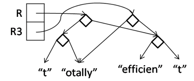
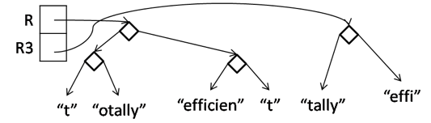

# Lab Two: Cord

> This lab was completed on June 19, 2019, with joint solutions by VE280 students. If you'd like to start it over, you can first delete the function definitions in `cord.cpp`, then implement them by yourself.

## Introduction

The most obvious implementation of a string is as an array of characters. However, this representation of strings is particularly inefficient at handling string concatenation.

A *cord* is a tree-like data structure that provides a more efficient way of concatenating strings. A cord is a pointer to a `cord` data structure defined as follows:

```
struct cord {
    size_t len;
    cord *left;
    cord *right;
    std::string data;
};
```

A valid cord must be either `nullptr`, a leaf, or a non-leaf. More specifically:

- `nullptr` is a valid cord. It represents the empty string.

- A cord is a leaf if it is non-`nullptr`, has a non-empty string data field, has `left` and `right` fields that are both `nullptr`, and has a strictly positive `len` equal to the length of the string in the `data` field.

- A cord is a non-leaf if it has non-`nullptr` left and right fields, both of which are valid cords, and if it has a `len` field equal to the sum of the `len` fields of its children. The `data` field of a non-leaf is unspecified, but for now we set it as the empty string for simplicity. We’ll call these non-leaves *concatenation nodes*.

Following is a cord example that represents the 15-character string `"happy birthday!"`:


We can also represent the same structure using a short-hand notation that illustrates the two different types of nodes, leaf nodes and concatenation nodes:


## Implementation

This lab aims to help you better understand recursion. Therefore, we have provided the implementation of functions 1 to 4, while leaving functions 5 to 8 for you to implement. You need to use recursion in these four functions. We encourage you to read the implementation of functions 1 to 4 before you start coding.

1. `bool is_cord(cord *c);`

   Check if a given cord is valid. 
   
   You can refer to this function to verify your understanding of cord validity.

2. `size_t cord_length(cord_t R);`
   
   Return the string length of a given cord.

3. `cord_t cord_new(const std::string &s);`

   Initialize a leaf node with a given string.
   
4. `cord_t cord_join(cord_t R, cord_t S);`

   Initialize a concatenation node with `R` as left child and `S` as right child.
   
   Here is an example, where we have 
   
   ```
   cord_t R = cord_join(cord_join(cord_new("t"), cord_new("otally")), cord_join(cord_new("efficien"), cord_new("t")));
   ```
   
   
   
5. `std::string cord_tostring(cord_t R);`

   Return the string represented by a given cord.
   
6. `char cord_charat(cord_t R, size_t i);`

   Get the character at index `i` in the string represented by a given cord. You can assume `0 <= i && i < cord_length(R)`.
   
7. `cord_t cord_sub(cord_t R, size_t lo, size_t hi);`

   Return the segment of the string represented by a given cord, from index `lo` (inclusive) to index `hi` (exclusive). You can assume `0 <= lo && lo <= hi && hi <= cord_length(R)`.
   
   The function should not change the structure of the original cord in any way, while also maximizing sharing between the old cord and the new cord and only allocating a new node when it is impossible to use the entire string represented by an existing cord.
   
   Here are some examples, where we have R as the cord representing `"totallyefficient"` as defined in function 4 example.
   
   - After running `cord_t R3 = cord_sub(R, 1, 16);`

     

   - After running `cord_t R3 = cord_sub(R, 1, 11);`

     

   - After running `cord_t R3 = cord_sub(R, 2, 11);`

     

   Running `cord_sub(R,0,1)` and `cord_sub(R,7,16)` should not cause any new memory to be allocated, because these substrings are captured by subtrees of the original cord. Running `cord_sub(R,2,3)` must return a newly-allocated leaf node containing the string `"t"`.
   
   HINT: in your recursive function, try to first identify all the cases where it is possible to return immediately without any new allocation. What cases are left?
   
8. `void cord_print(cord_t R);`

   Print the internal structure of a given cord to standard output. You need to print `""` for a cord representing the empty string, `"somedata"` for a leaf node, `( "some" "data" )` for a concatenation node. The output for the cord representing `"totallyefficient"` as defined in function 4 example is as below.
   
   ```
   ( ( "t" "otally" ) ( "efficien" "t" ) )
   ```


## Compilation

You can utilize the `Makefile` to compile:

```
make
```

or type the following command:

```
g++ -std=c++11 -Wall -o lab2 cord.cpp test.cpp
```

Then you can run the executable:

```
./lab2
```


## Submission
Please make a fork of the VE280 GitHub repository at <https://github.com/ve280/ve280>, then commit your updates to the files in `labs/lab2` and create a pull request. You can refer to this [tutorial](https://github.com/ve280/tutorials/blob/master/github_introduction.md#4-contribute-to-a-public-repository) on how to create pull requests.


## Acknowledgement
Lab 2 problems are designed by [Zian Ke](https://github.com/zianke) and [Yihao Liu](https://github.com/tc-imba).


## Reference

[1] CMU 15-513 (Introduction to Computer Systems) Cord Lab. <https://autolab.andrew.cmu.edu/courses/15513-m19/assessments/cordlab/writeup>.
