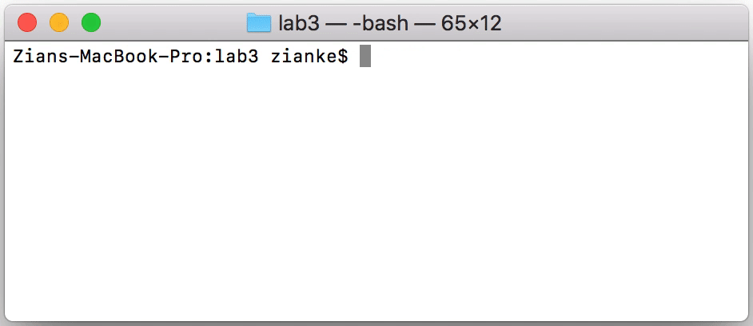
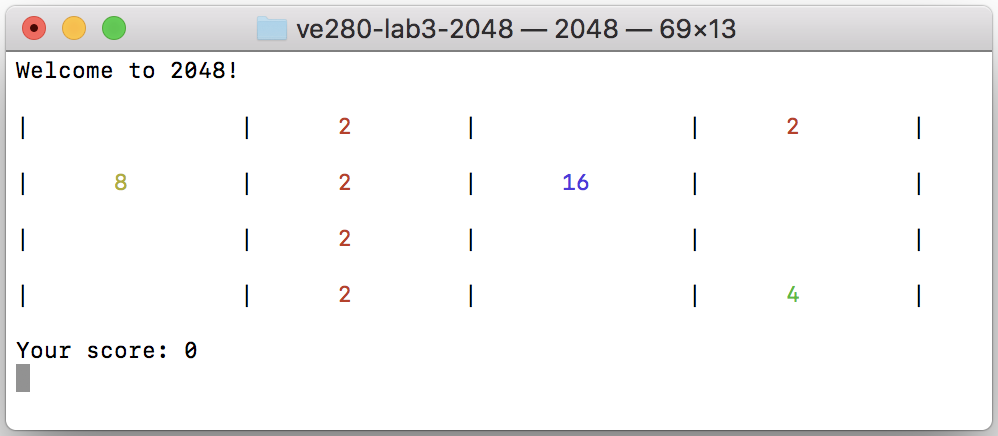

# Lab Three: 2048

## Introduction

The original version of 2048, developed by [Gabriele Cirulli](https://github.com/gabrielecirulli), is a web game written in HTML+CSS+JavaScript. You can find the source code in this [GitHub repository](https://github.com/gabrielecirulli/2048). In this lab, we are going to develop a C++ version of 2048. It should implement most of the basic features of 2048, which include printing grid, moving tiles and accumulating score. Some exciting bonus features, such as customized tile values with Emojis and Chinese characters, will also be implemented. You'll definitely enjoy playing with it in your terminal!



## Implementation

`Game`, `Grid` and `Tile` are three major classes/structures of this project. `Game` is the high-level game manager, which determines the win/lose conditions and stores the current score. `Game` contains a `Grid` object as its private member, which is basically a two-dimensional array with grid operations such as moving tiles and collapsing tiles. The tiles array in `Game` stores all the available `Tile`s. Each element of the `Grid`'s two-dimensional array is either a `nullptr` or a pointer to one `Tile` in `Game`'s tiles array. Please refer to the header files `game.h`, `grid.h` and `tile.h` for more details.

For this lab, we have provided you with most of the input/output functions. Please read the "Compilation" section first to get your code running. You should be able to see the game interface and a grid with 8 tiles printed with colors. For now pressing arrow keys does not move those tiles, but your operation has already been converted to a `Direction` enumerate type and taken as the input to the following functions to be implemented. Please feel free to add helper functions which you think are necessary to any class as private member functions.

1. `bool Grid::shiftTile(const Point &dst, const Point &src);`

   The function shifts/moves the tile from `src` to `dst`. You can assume `dst` and `src` are both inside the grid. However, you need to use the `bool Grid::isEmpty(const Point &pt) const` function to check these two points. If `src` is empty or `dst` is non-empty, nothing will happen. The function returns whether a position change occurs.

2. `bool Grid::shiftTiles(Direction dir);`

   The function moves all the possible tiles along direction `dir`. It returns whether there's any shifted tiles. Please do not collapse/remove any tile in this function even if two tiles with the same value are moved together. You could use a `switch` statement to implement one direction such as `UP` first, then think about if any of your code can be reused in other directions.
   
   Once you've finished function 1 and 2, please recompile your program and run the game. Try to press an arrow key and see whether the tiles are shifted correctly. Here's an example.
   
   - **Initial:**
   
   
   
   - **After `LEFT`:**
   
   
   
   - **After `RIGHT`:**
   
   

3. `void Grid::upgradeTile(const Point &pt);`

   The function upgrades the square at `pt` to the next level. For example, Tile "2" will become Tile "4". It requires `pt` to be inside the grid and non-empty. Before writing this function, you need to get familiar with the structure of the `Grid` class and the `Game` class. Each element of `Grid`'s 2D array `squares` stores either a `nullptr` or a `Tile` pointer, which points to the `tiles` array inside `Game`. This `tiles` array is in ascending order, i.e. from low points to high points. You can assume there are always enough tiles in this array. 
   
   HINT: Given a pointer to an array element, how would you make it point to the next element?

4. `unsigned int Grid::collapseTiles(Direction dir);`

   The function collapses all the possible tiles along direction `dir`. When two tiles merge, they become one upgraded tile. Please notice that four tiles in a row will be merged as two pairs. You also need to accumulate the points of the merged tiles. For example, when two "4" tiles merge, 8 points are added. You can obtain the points of each tile from the `Tile` structure. Return the totally earned points in this round.
   
   Once you've finished function 3 and 4, please recompile your program and run the game. Check if two tiles with the same value are merged into an upgraded one. You score should be accumulated too. Here's an example.
   
   - **Initial:**
   
   
   
   - **After `UP`:**
   
   
   
   - **After `DOWN`:**
   
   

5. `bool Game::checkWin() const;`

   The function checks all the tiles in the current grid. If there is any tile whose points value is at least `WINPOINTS`, then the player has won the game. `WINPOINTS` is defined in `const.h`, which is by default `2048`.

6. `bool Game::checkLose() const;`

   The function returns whether there's no feasible move in the current grid. If every square is full and any operation on any direction does not lead a tile to shift, then the game is over.

After implementing these 6 functions, please remove the `game.debugGrid();` statement in `2048.cpp`, which initializes a grid with 8 tiles for you to debug. Please also uncomment the `game.newTile();` statement in `2048.cpp`, so that a new tile is added into the grid after each move. Then you can compile the whole project and run the game in your terminal, together with trying customized tiles such as Chemistry Elements and Heavenly Stems. Have fun!

## Compilation

You can use IDE to write your code, but please avoid using the "Run" button or built-in terminal of IDE. Instead, use the default terminal of your operating system to compile your program.

You can utilize the `Makefile` to compile:

```
make
```

or type the following command:

```
g++ -std=c++11 -Wall -o 2048 2048.cpp direction.cpp game.cpp grid.cpp input.cpp point.cpp tile.cpp
```

Then you can run the executable:

```
./2048
```

or run with arguments:

```
./2048 <height> <width> <tiles-file>
```

We also provide several test cases to verify your solution:

```
make test
```


## Submission

Please make a fork of the VE280 GitHub repository at <https://github.com/ve280/ve280>, then commit your updates to the files in `labs/lab3` and create a pull request. You can refer to this [tutorial](https://github.com/ve280/tutorials/blob/master/github_introduction.md#4-contribute-to-a-public-repository) on how to create pull requests.


## Acknowledgement

Lab 3 problems are designed by [Zian Ke](https://github.com/zianke) and [Tianyi Ge](https://github.com/TimothyGe).


## Reference

[1] 2048 by Gabriele Cirulli. <https://github.com/gabrielecirulli/2048>.