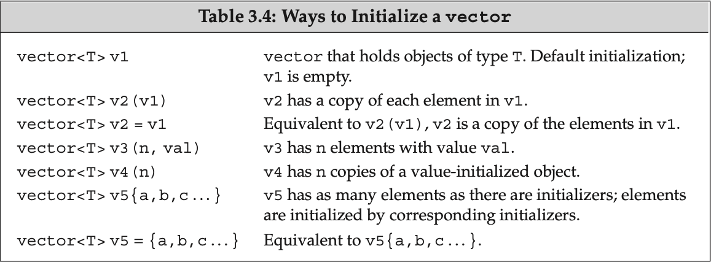
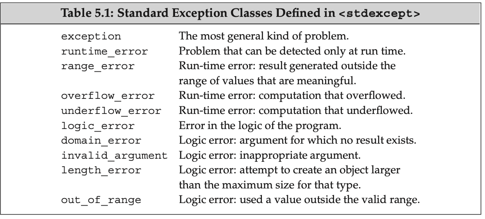
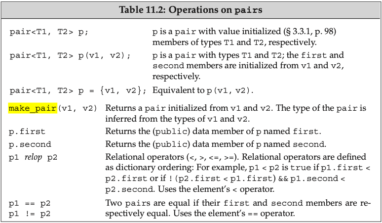
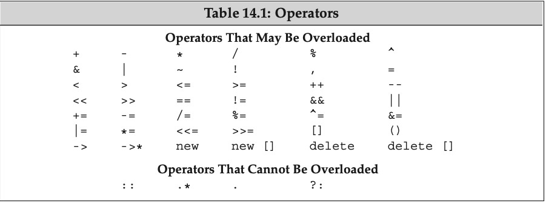

##### Some Notations in the book

1. Must-read =>

2. Skim =>

3. Tricky =>

4. Important terms are indicated in **bold**; important terms that we assume are already familiar to the reader are indicated in **bold italics**

864 pages to read in total, estimate time 20 days.


##### Part 0. Intro

###### Ch1. Getting Started

1. Function `return 0` means success, otherwise means fail 

   use `echo $?` to check in `Linux Shell`

2. To compile file => `g++ -std=c++11 -o a.out main.cpp` then `./a.out` (Exercise 1.1)

3. `iostream` library => `cin` = standard input, `cout` = standard output, `cerr` = standard error, `clog`

4. `endl` => flush butter => ensure buffer goes to output stream

5. All the names defined by the standard library are in the `std` namespace.

6. Good comment style (can not nest)

   ```c++
   /*
    * Simple main function:
    * Read two numbers and write their sum 
    */
   ```

7. Reading an Unknown Number of Inputs => `while`

   An `istream` becomes invalid when we hit **end-of-file** (ctrl-d) or encounter an invalid input

   ```c++
   // read until end-of-file, 
   while (std::cin >> value)
   ```

8. Common compile error => `syntax error`, `type error`, `declaration error`


##### Part 1. Basics

###### Ch2. Variables & Basic Types

1. Rule to choose data type: 

   • use `unsigned` as much as possible

   • do not overuse `char`(or specify `unsigned` or `signed`)

   • usually use `int`, `double`

2. Type conversion (happens automatically => compiler does the work)

   ```c++
   bool b = 42; // b is true, result is false if the value is 0 and true otherwise.
   int i = b; // i has value 1, resulting value is 1 if the bool is true and 0 if the bool is false.
   i = 3.14; // i has value 3
   double pi = i; // pi has value 3.0
   unsigned char c = -1; // assuming 8-bit chars, c has value 255
   signed char c2 = 256; // assuming 8-bit chars, the value of c2 is undefined
   ```

3. Avoid `undefined` and `implementation defined` (`nonportable`) behaviour

4. Don't mix `unsigned` with `signed`

   Regardless of whether one or both operands are unsigned, if we subtract a value from an unsigned, we must be sure that the result cannot be negative:

   ```c++
   unsigned u = 10;
   int i = -42;
   std::cout << u + i << std::endl; // if 32-bit ints, prints 4294967264
   ```

5. The compiler appends a null character `\0` to every string literal. Thus, the actual size of a string literal is one more than its apparent size.

6. separated only by spaces, tabs, or newlines are concatenated into one

    i.e. `"A" "B" is just "AB"`

7. Escape sequence: Note that if a `\` is followed by more than three octal digits, **only** the first three are associated with the `\`

   ```c++
   newline \n	horizontaltab \t	alert(bell) \a
   verticaltab  \v	backspace \b	doublequote \"
   backslash \\	question mark \?	single quote \’
   carriage return \r   formfeed \f
   ```

8. How to specify the Type of a Literal => pp.40

9. `list initialization` => `int x{0};`

   The compiler will not let us `list initialize` variables of built-in type if the initializer might lead to the loss of information

10. Separate compilation => A **declaration** makes a name known to the program. A file that wants to use a name defined elsewhere includes a declaration for that name. A **definition** creates the associated entity.

    ```c++
    extern int i; // declares but does not define i 
    int j; // declares and defines j
    // It is an error to provide an initializer on an extern inside a function.
    ```

11. C++ Keywords => pp.47

12. Scope (The global scope has no name `::`)

    ```c++
    int reused = 42; // reused has global scope
    int main() {
    	int unique = 0; // unique has block scope 
      // output#1: uses global reused; prints 42 0
    	std::cout << reused << " " << unique << std::endl; 
      int reused=0;
      // new,local object named reused hides global reused
    	// output#2: uses local reused; prints 0 0
    	std::cout << reused << " " << unique << std::endl;
    	// output#3: explicitly requests the global reused; prints 42 0 
      std::cout << ::reused << " " << unique << std::endl;
    return 0; }
    ```

13. Because there is no way to rebind a reference, references *must* be initialized.

    Reference may be bound only to an object, not to a literal or to the result of a more general expression

14. Reference VS Pointer: reference can not be changed cuz it is not object

15. The result of accessing an invalid pointer is undefined.

16. `nullptr`

    ```c++
    int *p1 = nullptr;// equivalent to int *p1 = 0;
    int *p2 = 0; // directly initializes p2 from the literal constant 0 
    // must #include cstdlib
    int *p3 = NULL; // equivalent to int *p3 = 0;
    ```

17. Generally, we use a void* pointer to deal with memory as memory, rather than using the pointer to access the object stored in that memory.

18. Base type and type modification:

    ```c++
    int i = 1024, *p = &i, &r = I;
    
    int* p1, p2; // p1 is a pointer to int; p2 is an int
    ```

19. How `const` is working?

    The compiler will usually replace uses of the variable with its corresponding value during compilation. That is, the compiler will generate code using the value 512 in the places that our code uses bufSize.

    When we define a const with the same name in multiple files, it is as if we had written definitions for separate variables in each file.

     To share a const object among multiple files, you must define the variable as `extern`.

20. A Reference to const May Refer to an Object That Is Not const

21. Const pointer => read from right to left

    ```c++
    const double *const pip = &pi;
    ```

22. For low-level const, we can convert a `nonconst` to `const` but not the other way round

    ```c++
    const int *const p3 = p2;
    int *p = p3;// error:p3 has a low-level const but p doesn’t
    ```

23. `constexpr` to verify if something is constant expressions ( pp. 65`= an expression whose value cannot change and that can be evaluated at compile time`) 

    ```c++
    constexpr int mf = 20; // 20 is a constant expression
    constexpr int limit = mf + 1; // mf + 1 is a constant expression 
    constexpr int sz = size(); // ok only if size is a constexpr function
    ```

24. It is important to understand that when we define a pointer in a constexpr declaration, the constexpr specifier applies to the pointer, not the type to which the pointer points

    ```c++
    const int *p = nullptr; // p is a pointer to a const int 
    constexpr int *q = nullptr; // q is a const pointer to int
    ```

25. `typedef` => `using`

    ```c++
    typedef int alis;
    using alis = int;
    ```

26. Because a declaration can involve only a single base type, the initializers for all the variables in the declaration must have types that are consistent with each other:

    ```c++
    auto i = 0, *p = &i; // ok: i is int and p is a pointer to
    int auto sz = 0, pi = 3.14; // error: inconsistent types for sz and pi
    ```

    1. When we use a reference as an initializer, the initializer is the corresponding object

    2. `auto` ordinarily ignores top-level consts (§ 2.4.3, p. 63). As usual in initializations, low-level `consts`, such as when an initializer is a pointer to `const`, are kept

    ```c++
    const int ci = i, &cr = ci;
    auto b = ci; // b is an int (top-level const in ci is dropped)
    auto c = cr; // c is an int (cr is an alias for ci whose const is top-level) 
    auto d = &i; // d is an int*(& of an int object is int*)
    auto e = &ci; // e is const int* (& of a const object is low-level const)
    const auto f = ci; // deduced type of ci is int;f has type const int
    ```

27. The way decltype handles top-level const and references **differs** subtly from the way auto does, including top-level const and references

    Another important difference between decltype and auto is that the deduction done by decltype *depends on the form of its given expression*.

    ```c++
    decltype ((i)) d; // error: d is int& and must be initialized 
    decltype (i) e; // ok:e is an (uninitialized) int
    ```

28.  Whenever a header is updated, the source files that use that header must be recompiled to get the new or changed declarations

29. Preprocessor variable names **do not** respect C++ scoping rules. To avoid name clashes with other entities in our programs, preprocessor variables usually are written in all uppercase

    

###### Ch3. String, Vector, Array

1. ```c++
   using std::cin;
   using std::cout; 
   using std::endl;
   ```

2. NEVER `using` in header files

3. ```c++
    // these are equivalent
    string s5 = "hiya"; // copy initialization
    string s6("hiya"); // direct initialization
    ```

4. String functions

   ```c++
   os << s	// Writes s onto output stream os. Returns os
   is >> s // Reads whitespace-separated string from is into s. Returns is
   getline(is, s) // Reads a line of input from is into s. Returns is
   s.empty() // Returns true if s is empty; otherwise returns false
   s.size() // Returns the number of characters in s
   s[n] // Returns a reference to the char at position n in s; positions start at 0
   s1+s2 // Returns a string that is the concatenation of s1 and s2
   s1=s2 // Replaces characters in s1 with a copy of s2
   s1==s2 // The strings s1 and s2 are equal if they contain the same characters. Equality is case-sensitive
   s1!=s2 <,<=,>,>= // Comparisons are case-sensitive and use dictionary ordering
   ```

5. The string input operator reads and discards any leading whitespace (e.g. spaces, newlines, tabs). It then reads characters until the next whitespace character is encountered

6.  The newline that causes `getline` to return is discarded; the newline is *not* stored in the string

7. `size` returns unsigned, so do not mix with signed

8. can’t add string literals 

   ```c++
   string s5 = "hello" + ","; // error:no string operand
   ```

9. In addition to facilities defined specifically for C++, the C++ library incorporates the C library. Headers in C have names of the form `name.h`. The C++ versions of these headers are named `cname` —they remove the `.h` suffix and precede the `name` with the letter `c`. The  `c` indicates that the header is part of the C library => In particular, the names defined in the `cname` headers are defined inside the `std` namespace

10. 

12.  Old style (do not use this)`vector<vector<int> >`

13. 

14. `{}` use `list initializer` if possible

    ```c++
    vector<string> v5 {"hi"}; // list initialization: v5 has one element 
    vector<string> v6 ("hi");// error: can’t construct a vector from a string literal 
    vector<string> v7{10}; // v7 has ten default-initialized elements 
    vector<string> v8{10, "hi"}; // v8 has ten elements with value "hi"
    ```

15. `size_type`, should have type

    ```c++
    vector<int>::size_type // ok 
    vector::size_type // error
    ```

16.  If the container is empty, the `iterators` returned by `begin` and `end` are equal—they are both off-the-end iterators

17. `iterator`

    ```c++
    for (auto it = s.begin(); it != s.end(); ++it)
    	*it = toupper(*it); 
    ```

18. `const_iterator` behaves like a const pointer

    ```c++
    vector<int>::const_iterator it3; // it3 can read but not write elements 
    ```
    
19. `cbegin` & `cend` are just `const` `begin` & `end`

    ```c++
    auto it3 = v.cbegin(); // it3 has type vector<int>::const_iterator
    ```

20. Shorthand => `it->mem` is a synonym for `(*it).mem`

21. Loops that use iterators should not add elements to the container to which the iterators refer => more in 9.3.6 (pp. 353)

22. `it1 - it2` returns a `difference_type`

23. `array` the dimension must be a constant expression

    ```c++
    unsigned cnt = 42; // not a constant expression 
    constexpr unsigned sz = 42; // constant expression
    											// constexpr see § 2.4.4 (p. 66)
    intarr[10]; // array of ten ints
    int *parr[sz]; // array of 42 pointers to int
    stringbad[cnt]; // error:cnt is not a constant expression
    stringstrs[get_size()];// ok if get_size is constexpr,error otherwise
    ```

24. If we omit the dimension, the compiler infers it from the number of initializers.

    ```c++
    int a2[] = {0, 1, 2}; // an array of dimension 3
    stringa4[3]={"hi","bye"}; // sameasa4[]={"hi","bye",""}
    int a5[2] = {0,1,2}; // error: too many initializers
    ```

25. `char array` are special

    ```c++
    char a1[] = {’C’, ’+’, ’+’}; // list initialization, no null
    char a3[] = "C++"; // null terminator added automatically
    const char a4[6] = "Daniel"; // error: no space for the null!
    ```

26. No copy/assignment! Some compilers allow array assignment as a **compiler extension**

27. Read from the inside out

    ```c++
    int *ptrs[10]; // ptrs is an array of ten pointers to int 
    int &refs[10] = /* ? */; // error: no arrays of references
    int (*Parray)[10] = &arr; // Parray points to an array of ten ints 
    int (&arrRef)[10] = arr; // arrRef refers to an array of ten ints
    ```

28.  In most expressions, when we use an object of array type, we are really using a pointer to the first element in that array

    ```c++
    string *p2 = nums; // equivalent to p2 = &nums[0]
    ```

29. `array` similar to `vector`

    ```c++
    int ia[] = {0,1,2,3,4,5,6,7,8,9}; // ia is an array of ten ints 
    int *beg = begin(ia); // pointer to the first element in ia
    int *last = end(ia); // pointer one past the last element in ia
    auto n = end(arr) - begin(arr); // n is ptrdiff_t
    ```

30. We can use the subscript operator on any pointer, as long as that pointer points to an element (or one past the last element) in an array

    ```c++
    int *p = &ia[2]; // p points to the element indexed by 2 
    int j = p[1]; // p[1] is equivalent to *(p + 1),
    							// p[1] is the same element as ia[3] 
    int k = p[-2]; // p[-2] is the same element as ia[0]
    ```

31. C strings are SHIT!

32. `string` `char*`  conversion

    ```c++
    char *str = s;// error: can’t initialize a char* from a string 
    string s(str);
    const char *str = s.c_str(); // ok
    ```

    

###### Ch4. Expression

1. lvalue <=> memory, rvalue <=> value, `decltype` difference

2. Precedence has order, but how they are evaluated are undefined

   ```c++
   int i = f1() * f2(); // order unknown
   int i = 0;
   cout << i << " " << ++i << endl; // undefined
   ```

3. The result of an assignment is its left-hand operand, which is an lvalue

4. Use prefix MORE

   Prefix: increments its operand and yields the *changed* object as its result. 

   Postfix: increment the operand but yield a copy of the original, *unchanged* value as its result

   ```c++
   int i = 0, j;
   j = ++i; // j = 1, i = 1: prefix yields the incremented value
   j = i++; // j = 1, i = 2: postfix yields the unincremented value
   ```

5. Suggestion: use `unsigned` for bitwise operators

6.  An overloaded operator has the same precedence and associativity as the built-in version of that operator

7. `,` comma operator (what is the usage of it ???) guarantees the order in which its operands are evaluated, the result of a comma expression is the value of its right-hand expression

8. Implicit type conversion => see example and rules on pp.160

9. Explicit type conversion

   `static_cast` assign larger arithmetic type to smaller type
   
   `const_cast` get rid of `const` (often used in overloading)
   
   ```c++
   cast-name<type> (expression);
   // cast-name being static_cast, dynamic_cast, const_cast, OR reinterpret_cast
   No longer use old style
   BAD! type (expr); // function-style cast notation 
   BAD! (type) expr; // C-language-style cast notation


###### Ch5. Statement

1. `Dangling else` : In C++ the ambiguity is resolved by specifying that each else is matched with the closest preceding unmatched if

2. `Switch` 

   two case labels same value => error

   `case` wrong type or non-constant => error

   If we need to define and initialize a variable for a particular case, we can do so by defining the variable inside a `block`

3. NEVER `goto`

4. try + throw + catch = error exception

5. `runtime_error err`

   `err.what()` returns a C string (`const char*`)

6. Four headers: `exception`, `stdexcept` see below table, `bad_alloc` see § 12.1.2 (p. 458), `type_info` see § 19.2 (p. 825)

6. 

   

###### Ch6. Function

1. In `function` although we know which argument initialises which parameter, we have NO guarantees about the order in which arguments are evaluated

2. Local static

   ```c++
   size_t count_calls(){
   		static size_t ctr = 0; // value will persist across calls
       return ++ctr;
   }
   int main() {
   		for (size_t i = 0; i != 10; ++i)
     			cout << count_calls() << endl;
   		return 0; 
   }
   ```

3. **Separate compilation** => lets us split our programs into several files, each of which can be compiled independently

   ```bash
   g++ -c file1.cpp
   g++ -c file2.cpp
   g++ file1.o file2.o -o main
   ```

4. Function parameter initialization works the same way as variable initialization

5. C use pointer in function => C++ use reference

6. multiple return => use reference

7. Top-level const is ignored

   ```c++
   void fcn(const int i) { /* fcn can read but not write to i */ } 
   void fcn(int i) { /* . . . */ } // error: redefines fcn(int)
   ```

8. We can initialize an object with a low-level const from a nonconst object but not vice versa => this rule apply to function argument as well

9. Correct way to pass 2d array => pp. 218

10. Command line arguments

    ```c++
    int main(int argc, char *argv[]) { ... }
    prog -d -o ofile data0 // will get
    argv[0] = "prog"; // or argv[0] might point to an empty string argv[1] = "-d";
    argv[2] = "-o";
    argv[3] = "ofile";
    argv[4] = "data0";
    argv[5] = 0;
    ```

11. How to pass varying number of parametres?

    1 ->`initializer_lists ` (can imagine as a `vector` of `const`)

    

    ```c++
    void error_msg(ErrCode e, initializer_list<string> il) {
    cout << e.msg() << ": "; for (const auto &elem : il)
                cout << elem << " " ;
            cout << endl;
    }
    ```

    2 -> `ellipsis` => allow programs to interface to C code that uses a C library facility named `varargs` (No type checking + must appear last)

    ```c++
    void foo(parm_list, ...);
    void foo(...);
    ```

12. Values are returned in exactly the SAME way as variables and parameters are initialized

12. NEVER return a reference/pointer to a local object

13. `error_msg` example in 11 should be using `vector<string>` in `c++11`

14. `main` don't need a `return` (compiler will add one for us), defined in `cstdlib` we have `return EXIT_FAILURE` and `return EXIT_SUCCESS`

15. Return type complicated => Make life easier => using `trailing return type` OR `decltype`

    ```c++
    auto func(int i) -> int(*)[10];
    decltype(xxx) *fun();
    // instead of 
    int (*func(int))[10];
    ```

16. Overloaded functions must differ in the number or the type(s) of their parameters

18. It is an error for two functions to differ only in terms of their return types

    See 7 for `const`

    ```c++
    Record lookup(const Account&);
    bool lookup(const Account&); // error: only the return type is different
    // each pair declares the same function
    Record lookup(const Account &acct);
    Record lookup(const Account&); // parameter names are ignored
    typedef Phone Telno;
    Record lookup(const Phone&);
    Record lookup(const Telno&); // Telno and Phone are the same type
    Record lookup(Phone);
    Recordlookup(constPhone); // redeclares Recordlookup(Phone)
    Record lookup(Phone*);
    Recordlookup(Phone*const);// redeclares Recordlookup(Phone*)
    // BUT
    // functions taking const and nonconst references or pointers have different parameters 
    // declarations for four independent, overloaded functions
    Record lookup(Account&); // function that takes a reference to Account 
    Recordlookup(constAccount&);// new function that takes a const reference
    Record lookup(Account*); // new function, takes a pointer to Account 
    Record lookup(const Account*); // new function, takes a pointer to const
    ```

18. The compiler determines which function to call by comparing the arguments in the call with the parameters offered by each function in the overload set => three possibilities

19. Ordinarily, it is a bad idea to declare a function locally only for concept explanation

    ```c++
    string read();
    void print(const string &);
    void print(double); // overloads the print function
    void fooBar(int ival)
    {
    	bool read = false; // new scope: hides the outer declaration of read 
    	string s = read();// error: read is a bool variable, not a function
    	// bad practice: usually it’s a bad idea to declare functions at local scope
      void print(int); // new scope: hides previous instances of print
      print("Value:"); //  error: print(const string &) is hidden
      print(ival); // ok: print(int) is visible
      print(3.14); // ok: calls print(int); print(double) is hidden
    } 
    ```

    In C++, `name lookup` happens before `type checking` !!!

20. `default values` => NOTE: if a parameter has a default argument, all the parameters that follow it must also have default arguments (and can omit only trailing (right-most) arguments)

    ```c++
    string screen(sz ht = 24, sz wid = 80, char backgrnd = ’ ’);
    ```

21. Can redeclare and add more default arguments
    
    ```c++
    string screen(sz, sz, char = ’ ’);
    string screen(sz, sz, char = ’*’); // error: redeclaration
    string screen(sz = 24, sz = 80, char); // ok: adds default arguments
    ```
    
22. Names used as default arguments are resolved in the scope of the function declaration

    ```c++
    sz wd = 80;
    char def = ’ ’;
    sz ht();
    string screen(sz = ht(), sz = wd, char = def); 
    stringwindow = screen();// calls screen(ht(),80,’’)
    
    void f2() {
    def = ’*’; // changes the value of a default argument
    sz wd = 100; // hides the outer definition of wd but does not change the default
    window = screen();// calls screen(ht(),80,’*’) }
    ```

23. `inline` => send a request to compiler (might be ignored) to expand a function in **compilation** time (request may be ignored)

    Many compilers will not inline a recursive function

    A 75-line function will almost surely not be expanded inline

24. `constexpr function` (need to review pp. 239) => The return type and the type of each parameter in a must be a literal type, and the function body must contain exactly one return statement => In order to be able to expand the function immediately, constexpr functions are implicitly `inline`

25. `assert` (runtime check), use `NDEBUG` to disable it

    ```bash
    in cpp file use #define NDEBUG or in command line
    g++ -D NDEBUG main.cpp
    ```

    Programs that include the `cassert` header may not define a variable, function, or other entity named assert

26. The compiler defines \_\_func\_\_ in every function. It is a local static array of const char that holds the name of the function

    ```bash
    __FILE__string literal containing the name of the file 
    __LINE__integer literal containing the current line number
    __TIME__string literal containing the time the file was compiled 
    __DATE__string literal containing the date the file was compiled
    ```

27. How compile decide which function when it comes to `override`? => pp. 244

28. When we use the name of a function as a value, the function is **automatically** converted to a pointer, but the return type does not do so


###### Ch7. Class

1. `abstract data type` = `data abstraction` + `encapsulation`

2. Functions defined in the class are implicitly inline (otherwise declare only)

3. Any direct use of a member of the class is assumed to be an implicit reference through `this` (a const pointer)

3. To make `this` `const`, since `this ` does not appear in parameter list(nowhere to `const` it), we can put `const` after the parameter list instead

4.  The compiler generates a default constructor automatically only if a class declares *no* constructors

5. Need the default constructor as well as other constructors (otherwise no default one generated)

   ```c++
   class_name() = default;
   ```

6. Constructor initialiser list

   ```c++
   Sales_data(const std::string &s, unsigned n, double p): bookNo(s), units_sold(n), revenue(p*n) { }
   ```

7. classes that manage dynamic memory, generally cannot rely on the synthesized versions of copy, assignment, and destruction (can avoid using `stl`)

8. Access specifiers: `public`, `private` (only difference between `class` and `struct`)

9. `Type Member` (often appear at top)

   ```c++
   public:
   typedef std::string::size_type pos;
   ```

10. Modify data member even inside a `const` member function => use `mutable`

11. Two different classes define two different types even if they define the same members

    ```c++
    struct First {
      	int memi;
      	int getMem();
    };
    struct Second {
      	int memi;
      	int getMem();
    };
    First obj1;
    Secondobj2 = obj1;// error:obj1 and obj2 have different types
    ```

12. after declaration before definition => incomplete type (forward declaration) limited usage

13. `friend` to whole class (friend need to be reviewed => pp.282)

    ```c++
    class Screen {
    		// Window_mgr members can access the private parts of class Screen 
    	  friend class Window_mgr;
    		// ...rest of the Screen class
    };
    ```

    `friend` to only one member function

    ```c++
    class Screen {
    		// Window_mgr::clear must have been declared before class Screen 
      	friend void Window_mgr::clear(ScreenIndex);
    		// ...rest of the Screen class
    };
    ```

    (Note: a class must declare as a friend each function in a set of overloaded functions that it wishes to make a friend)

15. Even if we define the function inside the class, we must still provide a decla- ration outside of the class itself to make that function visible

    ```c++
    struct X {
    		friend void f() { /* friend function can be defined in the class body */ } 
    		X() { f(); } // error: no declaration for f
    		void g();
    		void h();
    };
    void X::g(){return f();}// error: f hasn’t been declared
    void f(); // declares the function defined inside X 
    void X::h() { return f(); } // ok: declaration for f is now in scope

14. Order:  Member function definitions are processed *after* the compiler processes all of the declarations in the class

15. Order of scope first find in member function => then in class (to specify `this->var`) => outside of class `(::var)`

16. Use `constructor initialiser` instead of assignment =>  We *must* use the constructor initializer list to provide values for members that are const, reference, or of a class type that does not have a default constructor

17. In `constructor initialiser` based on order in which they appear in class definition => It is a good idea to write constructor initialisers in the same order as the members are declared => avoid using members to initialise other members

18. **delegating constructors** => similar to what I used in Swift (use one constructor for another constructor)

    ```c++
    class Sales_data {
    public:
    		// nondelegating constructor initializes members from corresponding arguments 
      	Sales_data(std::string s, unsigned cnt, double price): bookNo(s), 			
      			units_sold(cnt), revenue(cnt*price) { } 
      	// remaining constructors all delegate to another constructor
    		Sales_data(): Sales_data("", 0, 0) {} 
      	Sales_data(std::string s): Sales_data(s, 0,0) {} 
      	Sales_data(std::istream &is): Sales_data() { read(is, *this); }
    		// other members as before }
    ;
    ```

19. When `default initialization` happens? => pp. 293

19. In constructor, AT MOST 1 class-type conversion is allowed

20. Deny implicit conversion of constructor **explicit** (only needed for constructors with 1 argument) (only used for copy form of constructor, with `=`)

21. **aggregate class** => four conditions pp.298 => BAD

22. An `aggregate class` (§ 7.5.5, pp. 298) whose data members are all of literal type is a `literal class`, non-aggregate => meet conditions pp. 299

26. `static` member => similar to static in function => applies to all class objects

    For function, The keyword appears only with the declaration inside the class body

    ```c++
    //We can access a static member directly through the scope operator:
    double r;
    r = Account::rate(); // access a static member using the scope operator
    r = ac1.rate(); // throughanAccountobjectorreference
    ```

24.  Member functions can use static members directly, without the scope operator

24.  The best way to ensure that the object is defined exactly once is to put the definition of static data members in the same file that contains the definitions of the class non-inline member functions.

24.  In-class initialization of `static` => pp.303 need to review

30. Trick: `static` member can have the same type as the class type of which it is a member

    ```c++
    class Bar {
    public:
    		// ... 
    private:
    		static Bar mem1; // ok: static member can have incomplete type 
      	Bar *mem2; // ok: pointer member can have incomplete type 
      	Bar mem3; // error: data members must have complete type
    };
    ```

31. Another difference between static and ordinary members is that we can use a static member as a default argument

    ```c++
    class Screen {
    public:
    		// bkground refers to the static member 
      	// declared later in the class definition 
      	Screen& clear(char = bkground);
    private:
    		static const char bkground;
    };
    ```

    

##### Part2. C++ Library

###### Ch8. IO Library

1. how we can write our own input and output operators => Ch14

2. how to perform random access on files => Ch17

3. **wide characters** => use `w` , e.g. `wcin`, `wcout`, `wcerr`, `wifstream`

4. `ifstream` and `istringstream` inherit from `istream`

5. we cannot copy or assign objects of the IO types => thus we cannot have a parameter or return type that is one of the stream types

   ```c++
   ofstream out1, out2;
   out1 = out2; // error: cannot assign stream objects 
   ofstream print(ofstream);// error: can’t initialize the ofstream parameter 
   out2 = print(out2); // error: cannot copy stream objects
   ```

   => Functions that do IO typically pass and return the stream through `const references`

6. `machine-dependent` => `iostate`

   `badbit` = system-level failure, such as an unrecoverable read or write error

    `failbit` = recoverable error, such as reading a character when numeric data was expected

   Reaching end-of-file sets => `eofbit` + `failbit`

   `goodbit` => guaranteed to have the value 0, indicates no failures on the stream

7. 

8. the code that is executed when we use a stream as a condition is equivalent to calling `!fail()`

9. First `good` or `fail` => if `fail` `eof` or `bad`

10. Why Buffer? => Using a buffer allows the operating system to combine several output operations from our program into a single system-level write. Because writing to a device can be time-consuming

    Output buffers are not flushed if the program terminates abnormally

11. When buffer happens? => 5 conditions => see pp.314

    1. `endl` (manipulator)

       `flush` flushes the stream but adds no characters to the output

        `ends` inserts a null character into the buffer and then flushes it

    2. `cout << unitbuf;` => all writes will be flushed immediately

    3. When buffer is full

    4. End of main

    5. input stream tied to output stream (how to tie need to review => see pp.316)

       ```c++
       cin.tie(&cout); // illustration only: the library ties cin and cout for us 
       // old_tie points to the stream (if any) currently tied to cin
       ostream *old_tie = cin.tie(nullptr); // cin is no longer tied
       // ties cin and cerr; not a good idea because cin should be tied to cout 
       cin.tie(&cerr); // reading cin flushes cerr, not cout 
       cin.tie(old_tie);// reestablish normal tie between cin and cout
       ```

12. `fstream`, In § 17.5.3 (p. 763) we’ll describe how to use the same file for both input and output

    

13. `open` called automatically

    ```c++
    ifstream in(ifile); // construct an ifstream and open the given file 
    ofstream out; // output file stream that is not associated with any file 
    out.open(ifile + ".copy"); // open the specified file
    ```

14. File mode => each has restriction => pp.319

    

15. `sstream ` 

    

16. `istringstreams` => used for reading a line

17. `ostringstreams` => useful when we need to build up our output a little at a time but do not want to print the output until later => see example on pp.323


###### Ch9. Sequential Containers

1. Trade-off => 

   • The costs to add or delete elements to the container

   • The costs to perform nonsequential access to elements of the container

   

2. Ordinarily, it is best to use `vector` unless there is a good reason to prefer another container

3. Overview: the operations on the container types form a kind of hierarchy:

   - Some operations (**Table 9.2 (p. 330)**) are provided by all container types.

   - Other operations are specific to the sequential (**Table 9.3 (p. 335)**), the associative (**Table 11.7 (p. 438)**), or the unordered (**Table 11.8 (p. 445)**) containers.

   - Still others are common to only a smaller subset of the containers.

4. each container is defined in a header file with the same name as the type

5. Need to provide `constructor` if there is no default one

   ```c++
   // assume noDefault is a type without a default constructor
   vector<noDefault> v1(10, init); // ok: element initializer supplied 
   vector<noDefault> v2(10); // error: must supply an element initializer
   ```

6. Container(sequential & associative) operations => pp.330

7. Need to specify scope =>`list<string>::iterator iter;`

8. Different `iterator`

   ```c++
   list<string> a = {"Milton", "Shakespeare", "Austen"};
   auto it1 = a.begin(); // list<string>::iterator
   auto it2 = a.rbegin(); // list<string>::reverse_iterator
   auto it3 = a.cbegin(); // list<string>::const_iterator
   auto it4 = a.crbegin();// list<string>::const_reverse_iterator
   ```

9. How to `init`

    

10. It is worth noting that although we cannot copy or assign objects of built-in array types (§ 3.5.1, p. 114), there is no such restriction on array

    ```c++
    int digs[10] = {0,1,2,3,4,5,6,7,8,9};
    int cpy[10] = digs; // error: no copy or assignment for built-in arrays
    array<int, 10> digits = {0,1,2,3,4,5,6,7,8,9};
    array<int, 10> copy = digits; // ok: so long as array types match
    ```

11.  `assign`

     ```c++
     list<string> names;
     vector<const char*> oldstyle;
     names = oldstyle; // error: container types don’t match
     // ok: can convert from const char* to string 
     names.assign(oldstyle.cbegin(), oldstyle.cend());
     ```

12.  Excepting array, `swap` does not copy, delete, or insert any elements and is guaranteed to run in constant time => (can imagine as `swap` the pointers only)

13. SO => After the swap, pointers, references, and iterators remain bound to the same element they denoted before the swap

14. How to compare two containers, pp.340

    ```c++
    vector<int> v1 = { 1, 3, 5, 7, 9, 12 };
    vector<int> v2 = { 1, 3, 9 };
    vector<int> v3 = { 1, 3, 5, 7 };
    vector<int> v4 = { 1, 3, 5, 7, 9, 12 };
    v1 < v2 // true; v1 and v2 differ at element[2]: v1[2] is less than v2[2] 
    v1 < v3 // false; all elements are equal, but v3 has fewer of them;
    v1 == v4 // true; each element is equal and v1 and v4 have the same size() 
    v1 == v2 // false; v2 has fewer elements than v1
    ```

15. Sequence only

    

16. The new standard introduced three new members—`emplace_front`, `emplace`, and `emplace_back`—that construct rather than copy elements

17. Access in sequential

    

18.  The members that remove elements do not check their argument(s)

19. Erase operations

    

20. LeetCode => it is common to add a prev node for linked list

21. `resize`

    ```c++
    list<int> ilist(10, 42);// ten ints: each has value 42 
    ilist.resize(15); // adds five elements of value 0 to the back of ilist 
    ilist.resize(25, -1);// adds ten elements of value -1 to the back of ilist 
    ilist.resize(5); // erases 20 elements from the back of ilist
    ```

22. **Container Operations May Invalidate Iterators**

23. ```c++
    int main(int argc, char **argv)
    {
        vector<int> a{1, 2};
        a.push_back(3);
        cout << a.size() << endl;
        cout << a.capacity() << endl;
        a.shrink_to_fit();
        cout << a.capacity() << endl;
        a.reserve(10);
        cout << a.capacity() << endl;
        return 0;
    }
    ```

    

24. `string ` => table on pp.363

    ```c++
    s.substr(pos, len) 
    s.insert(pos, len, ch) // many versions
    s.erase(pos, len)
    s.append(str2)
    s.replace(pos, len, str2)
    s.compare // many versions
    ```

25. returns a `string::size_type` value that is the index of where the match occurred, if no match, return a static member (§ 7.6, p. 300) named `string::npos` (where to start is optional argument, `rfind` to search backward)

    

26. `conversion`

    

27. If the string can’t be converted to a number, These functions throw an `invalid_argument` exception (§ 5.6, p. 193). If the conversion generates a value that can’t be represented, they throw `out_of_range`

28. `adaptor` => `stack`, `queue`, `priority_queue`

29. By default both `stack` and `queue` are implemented in terms of `deque`, and a `priority_queue` is implemented on a `vector` => to override

    ```c++
    // empty stack implemented on top of vector 
    stack<string, vector<string>> str_stk;
    // str_stk2 is implemented on top of vector and initially holds a copy of svec 
    stack<string, vector<string>> str_stk2(svec);
    ```


###### Ch10. Generic Algorithms

1. `Algorithm` never execute container operations (except for a special class of iterator called `inserters` )

2. more than 100 algorithms => see `Appendix A` (2 categories:`read-only` and `write`)

   ```c++
   auto result = find(vec.cbegin(), vec.cend(), val);
   // sum the elements in vec starting the summation with the value 0 
   int sum = accumulate(vec.cbegin(), vec.cend(), 0);
   // roster2 should have at least as many elements as roster1 
   equal(roster1.cbegin(), roster1.cend(), roster2.cbegin());
   ```

3. Algorithms that use a single iterator to denote the second sequence assume that the second sequence is at least as large as the first

4. Algorithms do not check write (e.g. `fill_n`)

   ```c++
   vector<int>vec; // emptyvector
   // disaster: attempts to write to ten (nonexistent) elements in vec
   fill_n(vec.begin(), 10, 0);
   ```

5. `back_inserter ` => need to review

   ```c++
   vector<int>vec;// empty vector 
   auto it = back_inserter(vec); // assigning through it adds elements to vec 
   *it = 42; // vec now has one element with value 42
   
   vector<int>vec;// empty vector
   // ok: back_inserter creates an insert iterator that adds elements to vec 
   fill_n(back_inserter(vec), 10, 0); // appends ten elements to vec
   ```

6. ```c++
   // replace any element with the value 0 with 42 
   replace(ilst.begin(), ilst.end(), 0, 42);
   
   If we want to leave the original sequence unchanged, we can call replace_copy. 
   // use back_inserter to grow destination as needed 
   replace_copy(ilst.cbegin(), ilst.cend(), back_inserter(ivec), 0, 42);  
   ```

7. Eliminate adjacent duplicate =>  I guess `unique` use two pointer and does not actually delete

   ```c++
   void elimDups(vector<string> &words) {
   		// sort words alphabetically so we can find the duplicates 
     	sort(words.begin(), words.end());
   		// unique reorders the input range so that each word appears once in the
   		// front portion of the range and returns an iterator one past the unique range 
     	auto end_unique = unique(words.begin(), words.end()); 
   		// erase uses a vector operation to remove the nonunique elements
   		words.erase(end_unique, words.end()); 
   }
   ```

8. A stable sort maintains the original order among equal elements => `stable_sort`

8. Add `predicate` to functions `e.g.`  first define `cmp` then `sort(v.begin(), v.end(), cmp);`

9. Another way => `lambda expressions  `=> `[capture list](parameter list) -> return type {function body}`, where `capture list` is an (often empty) list of local variables defined in the enclosing function

10. A lambda specifies the variables it will use by including those local non-static variables in its capture list (by value or by reference)

    ```c++
    void biggies(vector<string> &words, vector<string>::size_type sz,
    ostream &os = cout, char c = ’ ’)
    {
    		// code to reorder words as before
    		// statement to print count revised  toprint to os 
      	for_each(words.begin(), words.end(), [&os, c](const string &s){os << s << c });
    }
    ```

11. `[&]` or `[=]` or `[&, var1]` or `[=, &var1]` => let compiler do the capture list for you (When we mix implicit and explicit captures, the first item in the capture list must be an `&` or `=`) => see table in pp.395

12. Another way is instead of `[&]`, use `mutable`

    ```c++
    void fcn3() {
    		size_t v1 = 42; // local variable
    		// f can change the value of the variables it captures
    		auto f = [v1] () mutable { return ++v1; }; 
      	v1 = 0;
    		auto j = f(); // j is 43
    }
    ```

13. Note: either use own function with bind or use lambda !!!

    ```c++
    // error: cannot deduce the return type for the lambda 
    transform(vi.begin(), vi.end(), vi.begin(), [](int i) { if (i < 0) return -i; else return i; });
    // we must use a trailing return type (§ 6.3.3, p. 229):
    transform(vi.begin(), vi.end(), vi.begin(), [](int i) -> int { if (i < 0) return -i; else return i; });
    ```

14. How to pass argument  => use `bind`, `auto newCallable = bind(callable, arg_list);`

    ```c++
    auto check6 = bind(check_size, _1, 6); 
    string s = "hello";
    bool b1 = check6(s); // check6(s) calls check_size(s, 6)
    ```
    
15. `using std::placeholders::_1;` => define `placeholder` one by one, to make life easier => use `using namespace std::placeholders;`

17. A trick we can use `bind` to reorder arguments/parameters

    `auto g = bind(f, a, b, _2, c, _1);` bounds `g(_1, _2)` to `f(a, b, _2, c, _1)`

18. can not copy `ostream` => Use of `ref` and `cref`

    ```c++
    // error:can not copy os
    for_each(words.begin(), words.end(), bind(print, os, _1, ’ ’));
    for_each(words.begin(), words.end(), bind(print, ref(os), _1, ’ ’));
    ```

19. `iterator` header provide other choices => `insert iterator`, `stream iterator`, `reverse iterator`, `move uterator ` (need to review!)

20. See difference

    `back_inserter` = `push_back`, `front_inserter` = `push_front`, `inserter` = `insert`

    ```c++
    list<int> lst = {1,2,3,4};
    list<int> lst2, lst3; // empty lists
    // after copy completes, lst2 contains 4321
    copy(lst.cbegin(), lst.cend(), front_inserter(lst2));
    // after copy completes, lst3 contains 1234
    copy(lst.cbegin(), lst.cend(), inserter(lst3, lst3.begin()));
    ```

21. When we create a stream iterator, we must specify the type of objects that the iterator will read or write

    ```c++
    istream_iterator<int>in_iter(cin); // read ints from cin 
    istream_iterator<int> eof; // istream ‘‘end’’ iterator 
    while (in_iter != eof) // while there’s valid input to read
      	vec.push_back(*in_iter++);
    
    // another way
    istream_iterator<int>in_iter(cin),eof; // read ints from cin 
    vector<int>vec(in_iter,eof); // construct vec from an iterator range
    ```
    
22. `Lazy` => when we bind an `istream_iterator` to a stream, we are NOT guaranteed that it will read the stream immediately

    ```c++
    istream_iterator<int> in(cin), eof; 
    cout << accumulate(in, eof, 0) << endl;
    ```

23. No `reverse iterator`  for `forward_list` or `stream iterator`

24. Relation between reverse & ordinary iterators => pp.409

24. 5 kinds of iterators

    ```c++
    Input iterator	// Read, but not write; single-pass, increment only
    Output iterator // Write, but not read; single-pass, increment only
    Forward iterator // Read and write; multi-pass, increment only
    Bidirectional iterator // Read and write; multi-pass, increment and decrement
    Random-access iterator //  Read and write; multi-pass, full iterator arithmetic
    ```

25. With the exception of output iterators, an iterator of a higher category provides all the operations of the iterators of a lower categories

26. Most of the algorithms have one of the following four forms:

    ```c++
    alg(beg, end, other args);
    alg(beg, end, dest, other args); 
    alg(beg, end, beg2, other args); // won't be checked
    alg(beg, end, beg2, end2, other args);
    ```

    some pass a predicate, e.g.

    ```c++
    unique(beg, end); // uses the == operator to compare the elements 
    unique(beg, end, comp); // uses comp to compare the elements
    ```

    `_if` version

    ```c++
    find(beg, end, val); // find the first instance of val in the input range 
    find_if(beg, end, pred); // find the first instance for which pred is true
    ```

    `_copy` version

    ```c++
    reverse(beg, end); // reverse the elements in the input range 
    reverse_copy(beg, end, dest);// copy elements in reverse order into dest
    ```

    `_copy_if` version

    ```c++
    // removes the odd elements from v1 
    remove_if(v1.begin(), v1.end(), [](int i) { return i % 2; }); 
    // copies only the even elements from v1 into v2; v1 is unchanged
    remove_copy_if(v1.begin(), v1.end(), back_inserter(v2), [](int i) { return i % 2; });
    ```

27. `list` and `forward_list` algos not that useful so I skip them (you can refer back as dictionary later)


###### Ch11. Associative Containers

1. `map` `set` => three dimensions (set or map, unique or multiple keys, order or unordered)

2. I learnt STL from LeetCode YYDS

3. For the ordered containers—`map`, `multimap`, `set`, and `multiset`—the key type must define a way to compare the elements. By default, the library uses the `<` operator for the key type to compare the key

4. We can define compare function for our own type, remembering that when we use decltype to form a function pointer, we must add a `*` to indicate that we’re using a pointer to the given function type `(§ 6.7, p. 250)`

   ```c++
   multiset<own_type, decltype(cmp)*> bookstore(cmp);
   ```

5. `pair` in `utility` header, in c++11, use `{}` instead of `pair` or `make_pair`

   

6. `key_type`, `mapped_type`, `value_map`

6. In general, we do not use the generic algorithms (Chapter 10) with the associative containers. The fact that the keys are const means that we cannot pass associative container iterators to algorithms that write to or reorder container elements

7. `Insert` => return `pair<iterator, bool>`

   

8. `xxx.erase(yyy)`

   

9. `find`

   

11. Trick => If `lower_bound` and `upper_bound` (**not valid for the unordered containers**) return the same iterator, then the given key is not in the container

    The important point is that the return values of `lower_bound` and `upper_bound` act like an iterator range (§ 9.2.1, p. 331)

    => we can use `equal_range` instead pp.440

11. Self-define functions => hash

    

13. By default, the unordered containers use the `==` operator on the key type to com- pare elements. They also use an object of type `hash<key_type>` to generate the hash code for each element. The library supplies versions of the **hash** template for the built-in types, including pointers

    Built-in type => can hash, BUT our own type => can not => must define our own version of the hash template => see § 16.5 (p. 709)

13. ```c++
    size_t hasher(const Sales_data &sd) {
        return hash<string>()(sd.isbn());
    }
    bool eqOp(const Sales_data &lhs, const Sales_data &rhs) {
        return lhs.isbn() == rhs.isbn();
    }
    using SD_multiset = unordered_multiset<Sales_data, decltype(hasher)*, decltype(eqOp)*>;
    SD_multiset bookstore(42, hasher, eqOp);
    ```


###### Ch12. Dynamic Memory

1. DM => bugs => use smart pointers (better than `new` & `delete`)

2. `shared_ptr`, `unique_ptr`, `weak_ptr` => `memory` header

3. Safest way => `make_shared`

   ```c++
   shared_ptr<int> p3 = make_shared<int>(42);
   auto p6 = make_shared<vector<string>>();
   auto q(p); // p and q point to the same object
   ```

4. 

5. `shared_ptr` has `reference count` (track how many `shared_ptr` points to the same object)

    it is up to the implementation whether to use a counter or another data structure to keep track of how many pointers share state

6. 

7. `placement new`

   ```c++
   int *p1 = new int;// if allocation fails, new throws std::bad_alloc
   int *p2 = new (nothrow) int; // if allocation fails, new returns a null pointer
   ```

8. `reset` (i.e. `p = nullptr`) after `delete` => avoid `dangling pointer`

9. Because we can’t implicitly convert a pointer to a smart pointer (never mix using them)

   ```c++
   shared_ptr<int> p1 = new int(1024); // error: must use direct initialization 
   shared_ptr<int> p2(new int(1024)); // ok: uses direct initialization
   ```

10. 

11.  It is dangerous to use a built-in pointer to access an object owned by a smart pointer

12. We can use reset to assign a new pointer to a `shared_ptr`

12. Smart pointers deal with exception well

12. Some library classes Sucks cuz they use `new` `delete`

13. When we create a `shared_ptr`, we can pass an optional argument that points to

    a deleter function (§ 6.7, p. 247)

    ```c++
    void f(destination &d /* other parameters */) {
        connection c = connect(&d);
        shared_ptr<connection> p(&c, end_connection);
        // use the connection
        // when f exits, even if by an exception, the connection will be properly closed
    }
    ```

16. `unique_ptr`

    Unlike `shared_ptr`, there is no library function comparable to make_shared that returns a `unique_ptr`. Instead, when we define a `unique_ptr`, we bind it to a pointer returned by `new`

    

17. `release` & `reset`

    ```c++
    p2.reset(p3.release()); // reset deletes the memory to which p2 had pointed
    ```

15. `unique_ptr` can specify a deleter as well, However, for reasons we’ll describe in § 16.1.6 (p. 676), the way `unique_ptr` manages its deleter is differs from the way `shared_ptr` does

    ```c++
    // p points to an object of type objT and uses an object of type delT to free that object 
    // it will call an object named fcn of type delT
    unique_ptr<objT, delT> p (new objT, fcn);
    ```

16. Binding a `weak_ptr` to a `shared_ptr` does not change the reference count of that `shared_ptr`

    That object will be deleted even if there are `weak_ptrs` pointing to it

17. Use `lock` to access a `weak_ptr` => need to review example pp. 474

    

18. Allocate array => what we call a dynamic array does not have an array type

    ```c++
    int *pia = new int[get_size()];
    ```

19. Legal to `new char[0]`

    ```c++
    char arr[0]; // error: cannot define a zero-length array 
    char *cp = new char[0]; // ok: but cp can’t be dereferenced
    ```

20. Alternative => use `unique_ptr`

    ```c++
    unique_ptr<int[]> up(new int[10]);
    up.release(); // automatically uses delete[] to destroy its pointer
    ```

21. Unlike `unique_ptr`, `shared_ptrs` provide no direct support for managing a dynamic array. If we want to use a `shared_ptr` to manage a dynamic array, we must provide our own deleter:

22. Why allocator => In general, coupling allocation and construction can be wasteful => The memory an allocator allocates is *unconstructed*

22. `allocator` / `allocate` => then `construct` => `destroy` => `dealloctate`

    

27. pp. 483 => some comparison with 2 algorithms in `memory`

    

24. Example of Library => `Text-Query Program` (pp. 484 - 490)

    

##### Part3. Tools for Class Authors

###### Ch13. Copy Control

1. 5 => `copy constructor`, `move constructor`, `copy-assignment operator`, `move-assignment operator`, and `destructor`

2. Unlike the synthesized default constructor (§ 7.1.4, p. 262), a copy constructor is synthesized EVEN IF we define other constructors

2. differences between direct initialization (constructor) and copy initialization (just copy)

3. Copy initialization ordinarily uses the copy constructor. However, as we’ll see in § 13.6.2 (p. 534), if a class has a move constructor, then copy initialization sometimes uses the move constructor instead of the copy constructor

4. Compiler can omit `copy/move` constructor

5. ` copy-assignment operator`

   ```c++
   class Foo {
   		public:
   		Foo& operator=(const Foo&); // assignment operator 
     	// ...
   };

6. `destructor` => only one destructor for a given class

   ```c++
   class Foo {
       public:
   		~Foo(); // destructor // ...
   };
   ```

7. When `destructor ` being called (5 cases) => see pp.502

8. Common error =>

   Copy pointer (but pointed to same object) => delete twice (can't delete same object) error

8. Once a class needs a destructor, it almost surely needs a copy constructor and copy-assignment operator as well

9. `= default` if in class body => ` inline`, or in the member's definition to avoid `inline` (mentioned § 7.1.4, p. 264)

10. To prevent a function (any dunction except destructor), use `delete`

    ```c++
    struct NoCopy {
    		NoCopy() = default; // use the synthesized default constructor 
    		NoCopy(const NoCopy&) = delete; // no copy NoCopy 
      	&operator=(const NoCopy&) = delete; // no assignment 
      	~NoCopy() = default; // use the synthesized destructor
    		// other members
    };
    ```

11. if a class has a data member that cannot be default constructed, copied, assigned, or destroyed, then the corresponding member will be a deleted function => pp. 508 

12. In old standard, use `private` instead of `delete`

15. Two kinds of class:

    Value-like: Avoid copying pointer only => copy the stuff => need to handle self-assignment

    Pointer-like: To copy pointer only => use `shared_ptr` => and use own `reference counter`

15. `swap` only need to swap the address(pointer)

16. Define own `swap`, For reasons we’ll explain in § 16.3 (p. 697), if there is a type-specific version of swap, that version will be a better match than the one defined in std

    ```c++
    class HasPtr {
    		friend void swap(HasPtr&, HasPtr&); 
      	// other members as in § 13.2.1 (p. 511)
    };
    inline
    void swap(HasPtr &lhs, HasPtr &rhs) {
    		using std::swap;
    		swap(lhs.ps,rhs.ps);// swap the pointers, not the string data
      	swap(lhs.i, rhs.i); // swap the int members
    }
    ```

17. `copy-control` example => pp.519 to 524

18. example `string vector` implementation => pp.524 to 531

18. The library containers, string, and `shared_ptr` classes support move as well as copy. The IO and `unique_ptr` classes can be moved but not copied

19. We can bind an rvalue reference to these kinds of expressions, but we cannot directly bind an rvalue reference to an lvalue

    ```c++
    int i = 42;
    int &r = i;				// ok:r refers to i
    int &&rr = i;			// error: cannot bind an rvalue reference to an lvalue
    int &r2 = i * 42;	// error:i*42 is an rvalue
    const int &r3 = i * 42;	// ok: we can bind a reference to const to an rvalue
    int &&rr2 = i * 42;	 // ok: bind rr2 to the result of the multiplication
    ```
    
19. The `move` function in `utility` header uses facilities that we’ll describe in § 16.2.6 (p. 690) to return an rvalue reference to its given object

23. NEVER free lhs before using sources from rhs =>NO exception allowed

    `move constructor` example

    We must specify noexcept on both the declaration in the class header and on the definition if that definition appears outside the class

    ```c++
    StrVec::StrVec(StrVec &&s) noexcept // move won’t throw any exceptions 
      	// member initializers take over the resources in s
    		: elements(s.elements), first_free(s.first_free), cap(s.cap){
    		// leave s in a state in which it is safe to run the destructor 
        s.elements = s.first_free = s.cap = nullptr;
    }
    ```

21. pp.531-549 13.6 => skipped, need to review

21. Rvalue reference => help member function to support both copy and move version

    ```c++
    void push_back(const X&); // copy: binds to any kind of X
    void push_back(X&&); // move: binds only to modifiable rvalues of type X
    ```
    
    

###### Ch14. Overloaded Operation & Conversions

1. Cannot override operands of built-in type

2. We’ll cover overloading new and delete in § 19.1.1 (p. 820)

3. ```c++
   data1 + data2; // normal expression 
   operator+(data1, data2); // equivalent function call
   data1 += data2; // expression-based ‘‘call’’ 
   data1.operator+=(data2); // equivalent call to a member operator function
   ```

4. An overloaded operator has the same precedence and associativity (§ 4.1.2, p. 136) as the corresponding built-in operator. Regardless of the operand types

    overloaded versions of these operators do not preserve order of evaluation and/or short-circuit evaluation

5. 

6. Several categories => `IO >> <<`, `Arithmetic/Relational`, `Assignment =`, `Subscript []`, `++ --`, `member accrss * ->`, `function call ()`, `conversion`

7. IO example,  MUST be nonmember functions

   ```c++
   ostream &operator<<(ostream &os, const Sales_data &item) {
   		os << item.isbn() << " " << item.units_sold << " " 
          << item.revenue << " " << item.avg_price();
   		return os; 
   }
   ```

8. Differ prefix and postfix by an additional int argument

8. Essence of lambda => lambdas Are Function Objects

9. Library function objects => often used to algorithms

   

   ```c++
   e.g. sort(svec.begin(), svec.end(), greater<string>());
   ```

10. `Callable function` = functions and pointers to functions, lambdas (§ 10.3.2, p. 388), objects created by bind (§ 10.3.4, p. 397), and classes that overload the function-call operator.

11. two callable objects with different types may share the same **call signature**

12. `Function table` => use `map` => Use `map<string, function<int(int, int)>>` instead of `map<string, int(int, int)>``

13. We can use `function` in `functional` header
    
    ```c++
    function<int(int, int)> f1 = add; // function pointer
    function<int(int, int)> f2 = divide(); // object of a function-object class
    function<int(int, int)> f3 = [](int i, int j){ return i * j; };// lambda
    
    cout << f1(4,2) << endl; // prints 6 
    cout << f2(4,2) << endl; // prints 2 
    cout << f3(4,2) << endl; // prints 8
    ```
    
15. 

16. `user-defined conversions`

    ```c++
    // if istream had a conversion to bool, the following code would compile:
    int i = 42;
    cin << i; // this code would be legal if the conversion to bool were not explicit
    // bool to be shift 42
    ```

17. to prevent => `explicit conversion operators`, with some exceptions (4 conditions) pp.582

18. If there is more than one way to perform a conversion, it will be hard to write unambiguous code (2 ways it happens) => see example in pp.584

19. Note that we can’t resolve the ambiguity by using a cast—the cast itself would have the same ambiguity, must explicitly call

20. 14.9 (About Conversion) => skipped and need to review


###### Ch15. OOP

1. The key ideas in **object-oriented programming** are data abstraction, inheritance, and dynamic binding (use objects of these types while ignoring the details of how they differ)

2. Use `virtual` => When we call a virtual function *through a pointer or reference*, the call will be dynamically bound. Depending on the type of the object to which the reference or pointer is bound, , the version in the base class or in one of its derived classes will be executed

3. the compiler will apply the derived-to-base conversion implicitly (§ 4.11, p. 159)

    ```c++
    Quote item; // object of base type
    Bulk_quote bulk; // object of derived type
    Quote *p = &item; // p points to a Quote object
    p = &bulk; // p points to the Quote part of bulk
    Quote &r = bulk; // r bound to the Quote part of bulk
    ```

4. a derived class must use a base-class constructor to initialize its base-class parts

    The base class is initialized first, and then the members of the derived class are initialized in the order in which they are declared in the class

5. we can use a static member through either the base or derived

6. A class must be defined, not just declared, before we can use it as a base class => impossible to derive a class from itself

7. `final`

    ```c++
    class NoDerived final{/* */};// NoDerived can’t be a base class
    ```

8. When we use a reference (or pointer) to a base-class type, we don’t know the actual type of the object to which the pointer or reference is bound => can bind a reference (or pointer) to a base-class type to a derived object (for both pointers & smart pointers)

9. Static type => compile time, dynamic type => run time

10. ```c++
    Bulk_quote bulk; // object of derived type
    Quoteitem(bulk);// uses the Quote::Quote(constQuote&) constructor 
    item=bulk; // calls Quote::operator=(const Quote&)
    ```

11. To override => same argument types + same return type (one exception, § 15.5 p. 613 + example in § 15.8.1 p. 633)

12. As we’ll see in § 15.6 (p. 620), it is legal for a derived class to define a function with the same name as a virtual in its base class but with a different parameter list => a bug when people try to override but has a typo => hard to find => use `override`

13. `default` argument => applies to static type

14. Use scope operator `::` to use a particular version of that virtual

    ```c++
    double undiscounted = baseP->Quote::net_price(42);
    ```

15. We cannot (directly) create objects of a type that is an abstract base class

16. We can ONLY use `constructor` of its direct base class 

17. `protected` => A derived class member or friend may access the protected members of the base class *only* through a derived object => example pp.612

18. Just as friendship is NOT transitive (§ 7.3.4, p. 279), friendship is also NOT inherited

19. When `private inheritance` we use `using`  to get access

20. By default, a derived class defined with the `class` keyword has `private` inheritance; a derived class defined with `struct` has `public` inheritance

21. Under inheritance, the scope of a derived class is nested (§ 2.2.4, p. 48) inside the scope of its base classes => compile time name lookup + name defined in derived class will hide name defined in base class (use scope operator to access)

22. Function name same => The base member is hidden even if the functions have different parameter lists:

    ```c++
    struct Base {
    		int memfcn();
    };
    struct Derived : Base { 
      	int memfcn(int); // hides memfcn in the base
    };
    Derived d; Base b; 
    b.memfcn();// calls Base::memfcn
    d.memfcn(10); // calls Derived::memfcn
    d.memfcn(); // error:memfcn with no arguments is hidden 
    d.Base::memfcn()// ok:callsBase::memfcn
    ```

23. If the base and derived members took arguments that differed from one another, there would be no way to call the derived version through a reference or pointer to the base class. For example => MUST same parameter in base & derived for virtual functons (needs review)

    ```c++
    class Base {
    public:
        virtual int fcn();
    };
    class D1 : public Base {
    public:
    		// hides fcn in the base; this fcn is not virtual
    		// D1 inherits the definition of Base::fcn()
    		int fcn(int); // parameter list differs from fcn in Base 
      	virtual void f2(); // new virtual function that does not exist in Base
    };
    class D2 : public D1 {
    public:
    		int fcn(int);// nonvirtual function hides D1::fcn(int) 
      	int fcn(); // overrides virtual fcn from Base
    		void f2(); // overrides virtual f2 from D1
    };
    Base bobj; D1 d1obj; D2 d2obj;
    Base *bp1 = &bobj, *bp2 = &d1obj, *bp3 = &d2obj; 
    bp1->fcn();// virtual call, will call Base::fcnatruntime 
    bp2->fcn();// virtual call, will call Base::fcnatruntime 
    bp3->fcn();// virtual call, will call D2::fcnatruntime
    
    D1 *d1p = &d1obj; D2 *d2p = &d2obj; 
    bp2->f2();// error:Base has no member named f2 
    d1p->f2();// virtual call, will call D1::f2() at runtime 
    d2p->f2();// virtual call, will call D2::f2() at runtime
    
    Base *p1 = &d2obj; D1 *p2 = &d2obj; D2 *p3 = &d2obj; 
    p1->fcn(42); // error: Base has no version of fcn that takes an int 
    p2->fcn(42); // statically bound, calls D1::fcn(int) 
    p3->fcn(42); // statically bound, calls D2::fcn(int)
    ```

24.  If a derived class wants to make all the overloaded versions available through its type, then it must override all of them or none of them => what if want to override some => `using`

25.  Executing delete on a pointer to base that points to a derived object has undefined behavior if the base’s destructor is not virtual

26. Virtual destructor => turn off synthesized `move` (see 15.7.2)

27. `delete` is inherited

28. Unlike the constructors and assignment operators, the destructor is responsible only for destroying the resources allocated by the derived class

29. for copy move we MUST explicitly use the copy (or move, assignment) constructor for the base class in the derived’s constructor initializer list

30.  If a constructor or destructor calls a virtual, the version that is run is the one corresponding to the type of the constructor or destructor itself

31. A derived class inherits its base-class constructors by providing a using dec- laration that names its (direct) base class

32. Unlike using declarations for ordinary members, a constructor using declaration does not change the access level of the inherited constructor(s) + a using declaration can’t specify `explicit` or `constexpr` + default not inherited 

33. When we need a container that holds objects related by inheritance, we typically define the container to hold pointers (preferably smart pointers (§ 12.1, p. 450)) to the base class

34. => irony: have no choice but to use pointers instead of object!!!

35. Skipped 15.8, 15.9 (example in pp. 634 to 649)


###### Ch16. Templates & Generic Programming (HARD!!! needs review)

1.   `template <typename T, class U> calc (const T&, const U&);`

2.   `nontype parameter`  => An argument bound to a `nontype` integral parameter must be a constant expression. Arguments bound to a pointer or reference `nontype` parameter must have static lifetime

     ```c++
     template<unsigned N, unsigned M>
     int compare(const char (&p1)[N], const char (&p2)[M]) {
     		return strcmp(p1, p2);
     }
     compare("hi", "mom");
     ```

3.   unlike nontemplate code, headers for templates typically include definitions as well as declarations

4.   Find error => errors can be detected during instantiation (usually link time)

5.   EXAMPLE => template version of StrBlob (§ 12.1.1, p. 456) => pp.659 to 668

6.   By default, the language assumes that a name accessed through the scope op- erator is not a type => use `typename`

7.   **default template arguments**

     ```c++
     template <typename T, typename F = less<T>>
     int compare(const T &v1, const T &v2, F f = F()) {
     		if (f(v1, v2)) return -1;
     		if (f(v2, v1)) return 1;
     		return 0;  
     }
     ```

8.   


##### Part4. Advanced Topics

###### Ch17. Specialized Library Facilities

1. Covers: `bitset`, `tuples`, `regex`, `random number`


###### Ch18. Tools for Large Programs

1.   Covers: `exception`, `namespaces`, `multiple/virtual inheritance`
2.    


###### Ch19. Specialized Tools & Techniques

1.   Covers: redefine memory allocation, run-time type identification (RTTI), pointers to class members, 3 aggregate types (unions, nested classes, and local classes), non-portable (volatile qualifier, bit-fields, and linkage directives)

