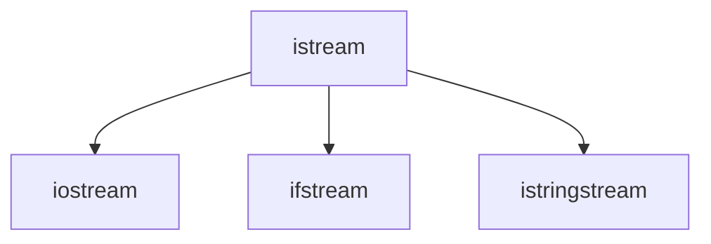

# Before Revision

`RTFM` is impolite yet the most educative response. Manual knows better than we do.


# Lecture 15-16: Classes in C++

## Subtype Polymorphism

Subtype relation is an “IS-A” relationship.

For examples, a Swan **is a** Bird, thus a class Swan is a subtype of class Bird. A bird can fly, can quake and can lay eggs. A swan can also do these. It might do these better, but as far as we are concerned, we don’t care. Bird is the super-type of the Swan.

### Liskov Substitution Principle

If $S$ is a subtype of $T$ or $T$ is a supertype of $S$, written $S <: T$, then for any instance where an object of type $T$ is expected, an object of type $S$ can be supplied without changing the correctness of the original computation.

- Functions written to operate on elements of the supertype can also operate on elements of the subtype. 
- Benefits: code reuse.

An example would be the input streams of c++:



### Compare: Type Coercion

Consider the following examples.

- Example 1: 

  Can we use an `ifstream` where an `istream` is expected? Is there ant type conversion happening in this piece of code?

  ```c++
  void add(istream &source) {
  	double n1, n2;
  	source >> n1 >> n2;
      cout << n1 + n2;
  }
  
  int main(){
      ifstream inFile;
      inFile.open("test.in")
  	add(inFile);
      inFile.close();
  }
  ```

- Example 2: Coercion.

  Can we use an `int` where a `double` is expected? Is there ant type conversion happening in this piece of code?

  ```c++
  void add(double n1, double n2) {
      cout << n1 + n2;
  }
  
  int main(){
      int n1 = 1;
      int n2 = 2;
  	add(n1, n2);
  }
  ```

### Creating Subtypes

In an Abstract Data Type, there are three ways to create a subtype from a supertype:

1. Add operations.
2. Strengthen the postconditions

- Postconditions include:
  - The EFFECTS clause
  - The return type

1. Weaken the preconditions

- Preconditions include:
  - The REQUIRES clause
  - The argument types


## Inheritance Mechanism

When a class (called derived, child class or subclass) inherits from another class (base, parent class, or superclass), the derived class is automatically populated with almost everything from the base class. 

- This includes member variables, functions, types, and even static members. 
- The only thing that does not come along is **friendship-ness**.
- We will specifically discuss the constructors and destructors later.

The basic syntax of inheritance is:

```c++
class Derived : /* access */ Base1, Base2, ... {
private:
	/* Contents of class Derived */
public:
	/* Contents of class Derived */
};
```

### Access Specifier

There are a three choices of access specifiers, namely `private`, `public` and `protected`.

The accessibility of members are as follows:

|      specifier      | private | protected | public |
| :-----------------: | :-----: | :-------: | :----: |
|      **self**       |   Yes   |    Yes    |  Yes   |
| **derived classes** |   No    |    Yes    |  Yes   |
|    **outsiders**    |   No    |    No     |  Yes   |

When declaring inheritance with access specifiers, the status of member in the derived classes are as follows:

| Inheritance \ Member |   private    | protected |  public   |
| :------------------: | :----------: | :-------: | :-------: |
|     **private**      | inaccessible |  private  |  private  |
|    **protected**     | inaccessible | protected | protected |
|      **public**      | inaccessible | protected |  public   |

When you omit the access specifier, the access specifier is assumed to be `private`, and the inheritance is assumed to be `private ` as well. The `struct` assumes `public`.

An example would be as follows. Which parts of the code does not compile? (Constructors and Destructors are omitted)

```c++
class Base {
    
	friend void friendBase(Base* b);
    
/* A */
private: 
    int priv; 
    void privMethod(){
        priv = 0;
    }
    
/* B */
protected:
    int prot; 
    void protMethod(){
        prot = 0;
    }
    
/* C */
public: 
    int pub; 
    void pubMethod(){
        pub = 0;
    }
    
};

class Derived : public Base {
    
	int derived;
    friend void friendDrived(Derived* d);
    
    /* D */
	void tryPrivDerived() { 
   		priv = 0; 
    	privMethod();
	}
    
    /* E */
    void tryProtDerived() { 
    	prot = 0; 
    	protMethod();
    }
    
    /* F */
	void tryPubDerived() { 
    	pub = 0; 
    	pubMethod();
    }
    
};

class PrivateDerived : Base {};
class Rederived : PrivateDerived {
    /* G */
    void tryPubRederived(){
        pub = 0;
        pubMethod();
    }
};

/* H */
void tryPrivOutside() { 
    Derived d;
    d.priv = 0; 
    d.privMethod(); 
}

/* I */
void tryProtOutside() { 
    Derived d;
    d.prot = 0; 
    d.protMethod(); 
}

/* J */
void tryPubOutside() { 
	Derived d;
    d.pub = 0; 
    d.pubMethod(); 
}

friend void friendBase(Base* b){
    /* K */
    b->priv = 0;
    b->privMethod();
}

friend void friendDrived(Derived* d){
    /* L */
    d->derived = 0;
    d->tryPubDerived();
    
    /* M */
    d->priv = 0;
    d->privMethod();
}
```

### Constructors and Destructors in Inheritance 

What would be the order of constructor and destructor call in a inheritance system? A short answer to remember would be:


Consider the following example:

```c++
class Parent {
public:
    Parent() { cout << "Parent::Constructor\n"; }
    virtual ~Parent() { cout << "Parent::Destructor\n"; }
};

class Child : public Parent {
public:
    Child() : Parent() { cout << "Child::Constructor\n"; }
    ~Child() override { cout << "Child::Destructor\n"; }
};

class GrandChild : public Child {
public:
    GrandChild() : Child() { cout << "GrandChild::Constructor\n"; }
    ~GrandChild() override { cout << "GrandChild::Destructor\n"; }
};

int main() {
    GrandChild gc;
}
```

Here’s what actually happens when derived is instantiated:

1. Memory for derived is set aside
   - Enough for both the Base and Derived portions, in fact
2. The appropriate Derived constructor is called
3. **The Base object is constructed first using the appropriate Base constructor**. If no base constructor is specified, the default constructor will be used.
4. The initialization list initializes variables
5. **The body of the constructor executes**
6. Control is returned to the caller

Thus the output would be:

```bash
Parent::Constructor
Child::Constructor
GrandChild::Constructor
GrandChild::Destructor
Child::Destructor
Parent::Destructor
```

~~See also the [default](https://en.cppreference.com/w/cpp/language/member_functions#Special_member_functions) keyword for good clang-tidy coding style.~~

~~See also the [explicit]() keyword to avoid unexpected conversion in single-argument constructor.~~

### Inheritance & Subtyping

**Inheritance is neither a sufficient nor a necessary condition of subtyping relation.** Yet, it is the only subtyping method supported by C++ (without a hack) in runtime. 

We can create a subtype simply by repeating everything.

```c++
class A {
public:
    void quak(){} 
};

class B {
public:
    void quak(){} 
    void nop(){}
};
```

Private inheritance prevents B from being a subtype of A.

```c++
class A {
    int priv;
};

class B : A {};
```

Yet, we will **assume public inheritance** in the rest of discussion.

### Pointer and Reference in Inheritance

From the language perspective, C++ simply trusts the programmer that every subclass is indeed a subtype. We have the following rules.

- Derived class pointer compatible to base class.
- Derived class instance compatible to base class (possibly `const`) reference.
- **You can assign a derived class object to a base class object.**

The reverse is generally false. E.g. assigning a base class pointer to derived class pointers needs special casting.

An example for the third rule is as follows. What would be the output?

```c++
class Base {
    string str;
public:
    Base() { cout << "base::default\n"; }
    Base(const Base& other) { cout << "base::copy\n"; }
};

class Derived1 : public Base {};

class Derived2 : public Base {
public:
    Derived2() = default;
    Derived2(const Derived2& d2) : Base(d2) { cout << "derived::copy\n"; }
};

int main() {
    //cout << "Derived 1: \n";
    Derived1 d1;
    Derived1 d1c(d1);
    
    //cout << "Derived 2: \n";
    Derived2 d2;
    Derived2 d2c(d2);
}
```

The output would be:

```bash
Derived 1:
base::default
base::copy
Derived 2:
base::default
base::copy
derived::copy
```

A synthesized copy constructor will do things almost identical to synthesized default constructor.

- Copy construct the base class. See `Derived1`.
- Copy construct every member, if there is any.
- Call the copy constructor of the class.

The case of `Derived2` shows how we do this manually.

Without default constructor (see `Derived3`), since you already provided a constructor, compiler won’t synthesize default constructor for you.

```c++
class Derived3 : public Base {
public:
    Derived3(const Derived3& d3) : Base(d3) { cout << "derived3::copy\n"; }
};

int main() {
    cout << "Derived 3: \n";
    Derived3 d3; // error
    Derived3 d3c(d3);
}
```

This code leads to a compile error.

Without copy constructing the base (see `Derived4`), the compiler will treat it as if the copy constructor is a usual constructor, defaulting constructing the base and all members.

```c++
class Derived4 : public Base {
public:
    Derived4() = default;
    Derived4(const Derived4& d4) { cout << "derived4::copy\n"; }
};

int main() {
    cout << "Derived 4: \n";
    Derived4 d4;
    Derived4 d4c(d4);
}
```

The output would be:

```bash
Derived 4:
base::default
base::default
derived4::copy
```

### `friend` Keyword

We may want to access private member of class instances. You could provide an accessing operator
for each of the member, but often it is not a good idea. One workaround is specifically grant access to the protected members. This can be done by using the `friend` keyword:

```c++
class Bar {
	friend void foo (const MyClass &mc);
}
```

It doesn’t matter where this is marked public or private. 

`friend` can also grant access to classes:

```c++
class Bar {
	friend class Baz; 
}
```

Pay attention that friend is not mutual. If Class A declares Class B as friend. Class B can access Class A’s private member, but the other way around doesn’t work.

### ~~Inheritance and Memory Map~~

~~Skipped. See [Memory Layout of C++ Object in Different Scenarios](http://www.vishalchovatiya.com/memory-layout-of-cpp-object/).~~

### ~~Multiple Inheritance & The Diamond Problem~~

~~Skipped. See [Multiple Inheritance](https://en.wikipedia.org/wiki/Multiple_inheritance).~~


## Virtuousness and Polymorphism

### Problem: Static Binding

Consider the following example.

```c++
class IntSet {
public:
    void insert(int i) { cout << "IntSet\n"; }
};

class SortedIntSet : public IntSet {
public:
    void insert(int i) { cout << "SortedIntSet\n"; }
};

void insert100(IntSet& set) { set.insert(100); }

int main() {
    SortedIntSet set;
    set.insert(10);
    insert100(set);
}
```

Now in `insert100()`, the method `insert()` is called on object set. set is an instance of `IntSet`. In this case, the compiler will choose the function `IntSet::Insert()`. Remember that the compiler have no idea what is actually referenced by set. When it compiles `insert100`, all it knows is that set refer to an object of `IntSet`. It doesn’t care if this object is part of a larger object. In fact, up till this point, when you make a function call in the code, the actual function being called is always know at compile time. The process of binding a function call to the actual definition is static.

The output is thus

```c++
SortedIntSet
IntSet
```

Consider the apparent type and actual type:

- Apparent Type: Apparent type is the type annotated by the type system. It is the static type information. It is the you remarked to the compiler.
- Actual Type: It is the data type of the actual instance. It is the data type that describes what exactly is in the memory.

In our previous example, in function `insert100()`, the apparent type of the variable set is `IntSet`, while what’s in the memory is actually a `SortedIntSet` (The actual type).

### Dynamic Polymorphism

#### `virtual` keyword

What we want is dynamic function binding, the ability to bind a function call based on an object’s actual type, instead of the apparent type. This is done through the virtual keyword. Using the previous example:

```c++
class IntSet {
public:
	virtual void insert(int i) {
        //...
    }
};
```

The above syntax marks insert as a `virtual` function.

The syntax marks insert as a virtual function (method).

Virtual methods are methods replaceable by subclasses. When a method call is made, if the method you are calling is a virtual function (based on the apparent type), the language bind the call according to the actual type. In this way, the function `insert100` achieves dynamic polymorphism, the ability to change its behavior based on the actual type of the argument.

#### `override` keyword

The act of replacing a function is called overriding a base class method. The syntax is as follows.

```c++
void insert(int i) override {
    //...
}
```

`override` cause the compiler to verify if a function is indeed overriding a base class method. If the base class method is not a virtual function, compiler will complain. The keyword is introduced in C++11. It is considered a best practice always mark override whenever possible.

Now, consider the adapted previous example:

```c++
class IntSet {
public:
    virtual void insert(int i) { cout << "IntSet\n"; }
};

class SortedIntSet : public IntSet {
public:
    virtual void insert(int i) override { cout << "SortedIntSet\n"; }
    // Note: It's good coding style to add `virtual` here.
};

void insert100(IntSet& set) { set.insert(100); }

int main() {
    SortedIntSet set;
    set.insert(10);
    insert100(set);
}
```

The output is now:

```
SortedIntSet
SortedIntSet
```

#### ~~`final` keyword~~

~~Skipped. See [final specifier (since C++11)](https://en.cppreference.com/w/cpp/language/final).~~

### ~~Virtual Table~~

~~Skipped.~~

~~Virtual function comes with cost in performance.~~ 

- ~~The cost of one extra layer of indirectness. There exists one more pointer dereference to find the target function. That’s one more memory access.~~
- ~~Cost of unknown call target. Modern processors will “prefetch”, or guess the future instructions and execute them in advance. Since the function call target is unknown, this will not be possible for virtual functions~~
- ~~Cost of unable to inline methods. For simple methods, compiler will try to inline them. Since the binding happens at runtime for virtual methods, this is no longer possible.~~

~~Using the `final` keyword will help. If the compiler is able to determine the actual type, it may choose to preform de-virtualization. Those costs could be quite huge if the method is used frequently. In old time the cost is often not durable. Modern computers are more powerful, things get better.~~

### Casting: `dynamic_cast` ~~& `const_cast`~~

A cast is an operator that forces one data type to be converted into another data type.

[Type erasure](https://en.wikipedia.org/wiki/Type_erasure) could be a problem. Consider when you pop something out of the container. The container only knows that the value is of type `Base*`. But you know it is actually an instance of `Derived*`. And most likely you need to use it as a `Derived` object. You need to transform a base class pointer to a derived class pointer.

In C++, dynamic casting is primarily used to safely downcast like casting a base class pointer (or reference) to a derived class pointer (or reference). It can also be used for upcasting, i.e. casting a derived class pointer (or reference) to a base class pointer (or reference).

* To use `dynamic_cast<new_type>(ptr)`, the base class should contain at least one virtual function.

* Dynamic casting checks consistency at runtime; hence, it is slower than static cast.

Below is an example.

```c++
class Shape{

    string s_name;

public:

    Shape(string name): s_name(name){}
    virtual void get_info(){ cout<<s_name<<endl; }

};

class Square : public Shape{

    int side;

public:

    Square(string S_name, int value) : Shape(S_name), side(value){}
    void get_info(){ cout<<"Area of the square is: "<<side * side<<endl; }

};

class Rectangle : public Shape{

    int length;
    int width;

public:

    Rectangle(string S_name, int len, int wid) : Shape(S_name), length(len), width(wid){}
    void get_info() override { cout<<"Area of the rectangle is: "<<length * width<<endl; }

};

Shape* create_square(string S_name, int value){
    return new Square(S_name, value);
}

Rectangle* create_rectangle(string S_name, int len, int wid){
    return new Rectangle(S_name, len, wid);
}

int main() {

    // quad is the pointer to the parent class, 
    // it needs to be casted to be used to
    // access the method of the child class.
    Shape *quad = create_square("Quadliteral", 4);

    // Trying to downcast the parent class pointer to
    // the child class pointer.
    Square* sq = dynamic_cast<Square*>(quad);

    // dynamic_cast returns returns null if the type
    // to be casted into is a pointer and the cast
    // is unsuccessful.
    if(sq){
        sq -> get_info();
    }

    Rectangle *rect = create_rectangle("Quadliteral", 4, 5);
    
    // An example of a valid upcasting
    Shape* quad1 = dynamic_cast<Shape*>(rect);
    
    // An example of invalid downcasting
    Square* sq1 = dynamic_cast<Square*>(quad1);

    if(!sq1){
        cout<<"Invalid casting."<<endl;
    }

}

```

~~See [const_cast](<https://en.cppreference.com/w/cpp/language/const_cast>) for its usage, it is skipped for now.~~


## Interfaces and Invariant

### Classes as Interfaces

Recall the two main advantages of an ADT:

1. Information hiding: we don't need to know the details of how the object is represented, nor do we need to know how the operations on those objects are implemented.
2. Encapsulation: the objects and their operations are defined in the same place; the ADT combines both data and operation in one entity.

To the caller, an ADT is only an interface, which is the contract for using things of this type.

The class mechanism failed to be a perfect interface. It mixes details of the implementation with the definition of the interface.

The method implementations can be written separately from the class definition and are usually in two separate files.  Unfortunately, the data members still must be part of the class definition. Since any programmer using your class see that definition, those programmers know something about the implementation.

What we prefer is to create an "interface-only" class as a base class, from which an implementation can be derived. Such a base class is called an *Abstract Base Class*, or sometimes a *Virtual Base Class*.

- Note: classes must contain their data members, so this class cannot have an real implementation.	

### Pure Virtual

It is possible that we do not supply a implementation when defining a base class. ~~In this case, the corresponding entry in the VTable would simply be left unfilled:~~

```c++
/* IntSet */ virtual void insert(int i) = 0;
```

In this case we say the method is pure virtual. 

If a class contains one or more pure virtual methods, we say the class is a pure virtual class. You only need to have one pure virtual function for a class to be “purely virtual”. Pure virtual class are also called abstract base classes, or interfaces.  It is often that the name abstract base classes starts with a case letter `I` for interface.

Note that **you can’t instantiate a pure virtual class.** This is one way to prevent users from instantiate your class (The other way is to make the constructor protected). However, you can always define references and pointers to an abstract class. 

*Abstract Base Classes* are often used to model abstract concepts. E.g. we would like to say things like Matrices are subclass of summable object. We would like to increase code reuse. Consider the following class:

```c++
class ISummable { 
public:
	/* Add item x to itself */
	virtual void add(ISummable& x) = 0; 
};
```

This class models the objects that are summable. Based on this modeling, we could write the following very general function: 

```c++
void sum(ISummable elem[],size_t size, ISummable& rst) {
	for (int i = 0; i < size; ++i) 
		rst.add(elem[i]); 
}
```

This will work for anything that is Summable object. When a class derives from an interface and provides an implementation, we say it implements the interface.

### Summary

Here is an comprehensive exercise. What would be the output?

```c++
struct Foo {
    void f() { cout << "a"; };
    virtual void g() = 0;
    virtual void c() const = 0;
};

struct Bar : public Foo {
    void f() { cout << "b"; };
    void g() { cout << "c"; };
    void c() const { cout << "d"; };
    void h() { cout << "e"; };
};

struct Baz : public Bar {
    void f() { cout << "f"; };
    void g() { cout << "g"; };
    void c() { cout << "h"; };
    virtual void h() { cout << "i"; };
};

struct Qux : public Baz {
    void f() { cout << "j"; };
    void h() { cout << "k"; };
};

int main() {
    Bar bar; bar.g();
    Qux qux; qux.g();
    Baz baz; baz.h();
    Foo& f1 = qux; f1.f(); f1.g();
    Bar& b1 = qux; b1.h();
    Baz& b2 = qux; b2.h();
    Bar* b3 = &qux; b3->h();
    Baz* b4 = &qux; b4->h();
    const Foo& f2 = *b3; f2.c();
    Baz& b5 = *b4; b5.c();
}
```

Answer would be `cgiagekekdh`.

### Invariant

An invariant is a set of conditions that must always evaluate to true at certain well-defined points; otherwise, the program is incorrect. For ADT, there is so called representation invariant.

It describes the conditions that must hold on those members for the representation to correctly implement the abstraction. It must hold immediately before exiting each method of that implementation, including the constructor.
Each method in the class can assume that the invariant is true on entry if the following 2 conditions hold:

- The representation invariant holds immediately before exiting each method (including the constructor);
- Each data element is truly private.

Writing some private  `bool isInvariant()` functions for *defensive programming* to check whether all invariants are true (before exiting, or after entering, each method):

Next, add assertions like `assert(isInvariant());` right before returning from any function that modifies any of the representation.


# Lecture 17: Dynamic Memory Allocation

## ~~Memory Management~~

~~Each running program has its own memory layout, separated from other programs. The layout consists of a lot of segments, including:~~

- ~~`stack`: stores local variables~~
- ~~`heap`: dynamic memory for programmer to allocate~~
- ~~`data`: stores global variables, separated into initialized and uninitialized~~
- ~~`text`: stores the code being executed~~

~~In order to pinpoint each memory location in a program’s memory, we assign each byte of memory an “address”. The addresses go from 0 all the way to the largest possible address, depending on the machine. As the figure below, the `text`, `data`, and `stack` segments have low address numbers, while the `stack` memory has higher addresses.~~


## `new` & `delete`

Mostly, a fixed-sized structure is undesired. Yet, VLA is forbidden in c++.

```c++
int num = 100;
int array[num]; // Error
```

This leads to:

```bash
warning: ISO C++ forbids variable length array 'array' [-Wvla]
```

In ISO c++ standard, it's not allowed to have variable length array. Although G++ allows this as an "extension" (because C allows it), if you add `-pedantic` to the compiling option, it will have warning.

`man g++`:

```bash
-Wpedantic
	-pedantic
  	Issue all the warnings demanded by strict ISO C and ISO C++; reject
    all programs that use forbidden extensions, and some other programs
		that do not follow ISO C and ISO C++.
```

It's not allowed to use variable length array in c++, especially if you want your code to be as portable as possible. This is where we need dynamic length array.

```c++
int num = 100;
int *array = new intnum;
delete [] array;
```

`new` and `new[]` does the following:

* Allocates space in heap (for one or a number of objects).
* Constructs object in-place (including, but not limited to ctor).
* Returns the “first” address.

The syntax for new operator are very simple.

```c++
Type* obj0 = new Type; // Default construction
Type* obj1 = new Type(); // Default construction
Type* obj2 = new Type(arg1, arg2);
Type* objA0 = new Type[size]; // Default cons each elt
Type* objA1 = new Type[size](); // Same as obj A0
```

Since `new` allocates memory from the heap, they essentially requested (and occupies) resources from the system. For long running programs resources must always be returned (or released) when the program is finished with them, otherwise the program will end up draining all system resources, in our case running out of memory.

`delete` and `delete[]` releases the objects allocated from `new` and `new[]` respectively. They does the following:

* Destroy the object (each object in the array) being released (by calling the destructor of the object).
* Returns the memory to the system. 

We must emphasize that deletion is not idempotent, i.e. `delete` an object more than once, or delete an array allocated using `new[]` by `delete` instead of `delete[]` cause UB! 

### Destructor

The destructors for any ADTs declared locally within a block of code are called automatically when the block ends.

```c++
{
	IntSet ip = IntSet(50);
	...		
} // ip will be destroyed by calling its destructor
```

Destructor of ADT will also be called when using `delete`. A effective destructors should:

* Be named as `~ClassName`
* Takes no argument and returns nothing (not even void)
* If one expect the class to be inherited the destructor should be declared as `virtual`
* Release resource allocated only in this class, do not release base class resources!!!

Consider that in lab8:

```c++
Node::~Node() {
  	// EFFECTS: destroy the whole tree rooted at sub
    // MODIFIES: this
    for(int i = 0; i < this->child_num; i++) { delete(children[i]); }
    delete[] children;
}
```

## Memory Leaks

If an object is allocated, but not released after the program is done with it, the system would assume the resource is still being used (since it won’t examine the program), but the program will never use it. Thus resource is “leaked”, i.e. no longer available for using. In our case the leaked resource is memory.

`valgrind` is not a tool that only looks for memory leaks. It actually looks for for all sorts of memory related problems, including:

- Memory Leaks
- Invalid accesses
  - Array out-of-range
  - Use of freed memory
- Double free problems

Consider the following examples. Which implementation if free of leakage and why?

1. Memory Leaks.

```c++
class Base {
protected:
	int *p;
public:
	Base() : p(new int(10)) {}
	~Base() {delete p;}
};

class Derived : public Base {
	int *q;
public:
	Derived() : Base(), q(new int(20)) {}
	~Derived() {delete q;}
};

/* A */
void main() {
	Base* ptrA = new Derived;
	delete ptrA;
}

/* B */
void main() {
	Derived* ptrB = new Derived;
	delete ptrB;
}
```

2. Double Deletion.

```c++
class Base {
protected:
    int *p;
public:
    Base() : p(new int(10)) {}
    virtual ~Base() {delete p;}
};

class Derived : public Base {
    int *q;
public:
    Derived() : Base(), q(new int(20)) {}
    virtual ~Derived() override {delete p; delete q;}
};

/* A */
void main() {
	Base* ptrA = new Derived;
	delete ptrA;
}

/* B */
void main() {
	Derived* ptrB = new Derived;
	delete ptrB;
}
```

How to correct the codes?

```c++
class Base {
protected:
    int *p;
public:
    Base() : p(new int(10)) {}
    virtual ~Base() {delete p;}
};

class Derived : public Base {
    int *q;
public:
    Derived() : Base(), q(new int(20)) {}
    virtual ~Derived() override {delete q;}
};
```


# Lecture 18: Deep Copy

## Shallow Copy & Deep Copy

Because C++ does not know much about your class, the default copy constructor and default assignment operators it provides use a copying method known as a member-wise copy, also known as a *shallow copy*.


This works well if the fields are values, but may not be what you want for fields that point to dynamically allocated memory. The pointer will be copied. but the memory it points to will not be copied: the field in both the original object and the copy will then point to the same dynamically allocated memory, this causes problem at erasure, causing **dangling pointers**.

Instead, a *deep copy* copies all fields, and makes copies of dynamically allocated memory pointed to by the fields.


### The Rule of the Big 3/5

If you have any dynamically allocated storage in a class, you must follow this Rule of the Big X, where X = 3 traditionally and X = 5 after c++11.

> Whenever an object owns resources, any resources, not just memory, it should implement 5 methods: A ctor and a dtor, A copy ctor, a move ctor, a copy assignment operator, and a move assignment operator.

These are 5 typical situations where resource management and ownership is critical. You should never leave them unsaid whenever dynamic allocation is involved. Traditionally **constructor/destructor/copy assignment operator** forms a rule of 3. Move semantics is a feature available after C++11, which is not in the scope of this course. Learn more about them in EECS 381.

If you want to use the version synthesized by the compiler, you can use `= default`:

```c++
Type(const Type& type) = default;
Type& operator=(Type&& type) = default;
```

Usually, we would need to implement some private helper functions `removeAll()` and `copyFrom()`, and use them in the big 3. Consider the `Dlist` example.

* A destructor

```c++
template <class T>
Dlist<T>::~Dlist() {
    removeAll();
}
```

* A copy constructor

```c++
template <class T> 
Dlist<T>::Dlist(const Dlist &l): first(nullptr), last(nullptr) {
  copyAll(l); 
}
```

* An assignment operator

```c++
template <class T>
Dlist<T> &Dlist<T>::operator=(const Dlist &l) {
    if (this != &l) {
        removeAll();
        copyAll(l);
    }
    return *this;
}
```

### Example

Recall binary tree and in-order traversal. We define that a good tree is a binary tree with ascending in-order traversal. How to deep copy a template good tree provided interface:

```c++
template <class T> 
class GoodTree { 
		T *op; 
		GoodTree *left; 
		GoodTree *right; 
public:
  	void removeAll(); 
  	// EFFECTS: remove all things of "this" 
  	void insert(T *op); 
  	// REQUIRES: T type has a linear order "<" 
  	// EFFECTS: insert op into "this" with the correct location
  	//					Assume no duplicate op.
};
```

You may use `removeAll` and `insert` in your `copyAll` method.

---

The sample answer is as follows.

```c++
template <class T> 
void GoodTree<T>::copy_helper(const GoodTree<T> *t) { 
  	if (t == nullptr) 
      	return; 
  	T *tmp = new(t->op); 
  	insert(tmp); 
  	copy_helper(t->left); 
  	copy_helper(t->right); 
}

template <class T> 
void GoodTree<T>::copyAll(const GoodTree<T> &t) {
		removeAll();
  	copy_helper(&t); 
}
```

### ~~Exception Safety~~

~~Skipped. See [Lessons Learned from Specifying Exception-Safety for the C++ Standard Library](<https://www.boost.org/community/exception_safety.html>).~~


# Lecture 19: Dynamic Resizing

In many applications, we do not know the length of a list in advance, and may need to grow the size of it when running the program. In this kind of situation, we may need dynamic resizing. 

## Array

If the implementation of the list is a dynamically allocated array, we need the following steps to grow it:

- Make a new array with desired size. For example, 

  ```c++
  int *tmp = new int[new_size];
  ```

- Copy the elements from the original array to the new array iteratively. Suppose the original array is `arr` with size `size`.

  ```c++
  for (int i = 0; i < size; i++){
      tmp[i] = arr[i];
  }
  ```

- Replace the variable with the new array and delete the original array. Suppose the original array is `arr`:

  ```c++
  delete [] arr;
  arr = tmp;
  ```

- Make sure all necessary parameters are updated. For example, if the `size` of array is maintained, then we can do:

  ```cpp
  size = new_size;
  ```

Common selections of `new_size` can be:

- `size + 1`: This approach is simplest but most inefficient. Inserting `N` elements from capacity 1 needs `N(N-1)/2` number of copies.
- `2*size`: Much more efficient than `size+1`. The number of copies for inserting `N` elements becomes smaller than `2N`.
- What about even larger (eg: `size^2`)? Usually not good, for it occupies far too much memory.

Learn more about amortized complexity in VE281/EECS281.

## Linked lists

To enlarge a list implemented by linked list, you can simply add a node at the end of the linked list. 

The good thing about this is that no copy is required. Details in later discussions.


# Lecture 20: Linked List

Recall what you have implemented in lab 9-10 & project 5.

## Single-Ended & Doubly-Ended

Linked lists could be either single ended or doubly linked, depending on the the number of node pointers in the container.

In a singly ended list, we only need a `first`.

```c++
class IntList {
    node *first;
    //...
};
```

In a doubly ended list, we need also a `last`.

```c++
class IntList {
    node *first;
    node *last;
    //...
};
```

Especially, when handling a singly ended list, you need to be concerned about the special situation where

* size = 0: `first` is `nullptr`
* size = 1: `first` is the last and only node in the list. 

In a doubly ended list, the `last` makes it slightly more complicated:

- size = 0: `first` and `last` is `nullptr`
- size = 1: `first` is connecting to `last`. 

## Singly-Linked & Doubly-Linked

Linked lists could be either single linked or doubly linked, depending on the the number of directional pointers in `node`.

In a singly linked list, we only need a `next`.

```c++
struct node {
	node *next;
	int value;
};
```


In a doubly linked list, we need also a `prev`.

```c++
struct node {
	node *next;
	node *prev;
	int value;
};
```


## Linked List Methods

### Insertion

Insertion at ends:


Insertion after:


Insertion before:


### Deletion

